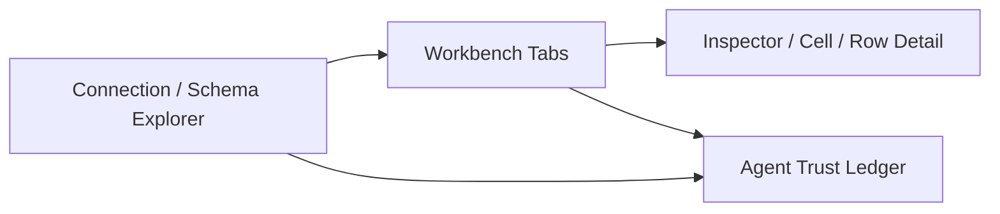

# DataGrip 디자인 분석 및 dopedb 개선 제안

작성일: 2026-07-08
분석 대상: JetBrains DataGrip 공식 2026.1 제품/도움말 자료
비교 대상: `/Users/jaesong/Documents/agent-db`의 dopedb 데스크톱 클라이언트

## 범위

이 문서는 DataGrip의 공개 UI/UX 패턴을 최대한 분석하고, 그중 dopedb에 적용할 만한 개선 방향을 정리한 문서다.

근거는 JetBrains 공식 제품 페이지, 2026.1 Help 문서, 2026.1 What's New, 그리고 이번 감사에서 직접 캡처한 화면이다. 설치된 DataGrip 앱을 직접 조작한 것은 아니므로, 키보드 접근성, 스크린리더 출력, hover 상태, 실제 성능, 전체 온보딩 흐름은 검증하지 못했다.

## 증거 자료

이 폴더에 저장된 캡처:

1. `01-datagrip-features.png` - DataGrip 공식 기능 페이지.
2. `02-database-explorer-doc.png` - Database Explorer 문서 첫 화면.
3. `03-data-editor-doc.png` - Data editor and viewer 문서 첫 화면.
4. `04-query-console-doc.png` - Query consoles 문서 첫 화면.
5. `05-whatsnew-2026-1.png` - DataGrip 2026.1 What's New 첫 화면.
6. `06-database-explorer-screenshot-section.png` - Database Explorer 실제 UI 스크린샷 구간.
7. `07-data-editor-screenshot-section.png` - Data editor 실제 UI 스크린샷 구간.
8. `08-query-console-screenshot-section.png` - Query console 실제 UI 스크린샷 구간.
9. `09-whatsnew-ai-mcp-section.png` - AI agentic flow 설명 구간.
10. `10-whatsnew-mcp-consent-section.png` - Codex가 통합된 AI Chat 스크린샷 구간.
11. `11-whatsnew-mcp-consent-list.png` - MCP database capability 및 consent 설명 구간.

주요 공식 출처:

- https://www.jetbrains.com/datagrip/
- https://www.jetbrains.com/datagrip/features/
- https://www.jetbrains.com/datagrip/whatsnew/
- https://blog.jetbrains.com/datagrip/2026/03/26/datagrip-2026-1-redesigned-query-files-data-source-templates-in-your-jetbrains-account-ai-agents-in-the-ai-chat-explain-plan-flow-enhancements-and-more/
- https://www.jetbrains.com/help/datagrip/database-explorer.html
- https://www.jetbrains.com/help/datagrip/data-editor-and-viewer.html
- https://www.jetbrains.com/help/datagrip/query-consoles.html
- https://www.jetbrains.com/help/datagrip/services-tool-window.html
- https://www.jetbrains.com/help/datagrip/quick-start-guide.html

## 핵심 요약

DataGrip의 디자인은 단순히 예뻐서 강한 것이 아니다. 강점은 “데이터베이스 IDE”로서의 공간 구조가 매우 단단하다는 점이다.

- 왼쪽 Database Explorer가 연결, 스키마, 객체 계층, 검색, 필터, 그룹, 색상, 빠른 이동의 기준점이다.
- 중앙 워크벤치는 데이터 보기, 쿼리 파일/콘솔, 실행 결과를 분리하면서도 스키마 컨텍스트를 계속 붙잡는다.
- 툴바는 조밀하지만 명확한 위치에 있다. 그리드 액션은 그리드 주변에, SQL 실행 액션은 에디터 주변에, 실행 계획 액션은 Query Plan 주변에 있다.
- 쿼리 실행은 단발성 출력이 아니라 세션, Output, Result 탭, 히스토리, 실행 계획, 연결 컨텍스트를 가진 작업으로 취급된다.
- 2026.1 변화는 “기능 추가”보다 “숨은 워크플로를 더 찾기 쉽게 만들기”에 가깝다. Query Files 폴더, 단순화된 Explain Plan 메뉴, plan row 상세 패널, AI agent 통합, MCP consent 모델이 그 예다.

dopedb는 DataGrip 전체를 복제하면 안 된다. 더 좋은 방향은 DataGrip의 공간 규칙을 빌리되, agent-safe 데이터베이스 워크벤치로 더 가볍고 명확하게 만드는 것이다.

## DataGrip에서 배울 패턴

### 1. Database Explorer가 제품의 척추다

DataGrip의 Database Explorer는 단순한 테이블 리스트가 아니다. 공식 문서는 이 영역을 데이터베이스와 DDL data source를 다루고, 데이터 구조를 보고 수정하며, data source, schema, table 등을 트리로 탐색하는 곳으로 설명한다.

관찰한 패턴:

- 항상 보이는 트리가 사용자의 위치 감각을 만든다.
- 트리에서 바로 입력하면 객체 검색이 된다.
- 객체 필터는 data source 설정과 tool window view option 양쪽에서 다룰 수 있다.
- 어떤 database/schema를 introspect하고 보여줄지 명시적으로 선택한다.
- data source를 폴더로 그룹화할 수 있다.
- View Options로 그룹 표시, 정렬, 표시 밀도 등을 바꾼다.
- data source 색상이 Database Explorer, editor, grid, toolbar까지 이어질 수 있다.

dopedb 개선 방향:

- 현재 sidebar를 단순 테이블 목록에서 object explorer로 키운다.
- row count는 보조 정보로 낮추고, 테이블 이름과 타입을 먼저 읽히게 한다.
- 현재 connection/schema/table 컨텍스트가 한눈에 보여야 한다.
- 표시 옵션은 항상 노출하지 말고 compact menu로 둔다.

### 2. Data editor는 그리드가 아니라 명령 표면이다

DataGrip의 data editor는 database object data, query result set, user file data를 같은 그리드 언어로 다룬다. 기본 Table view에서 filter, sort, 직접 cell edit, row 작업을 할 수 있다.

관찰한 패턴:

- Toolbar가 먼저 있고, 그 아래 데이터가 있다.
- WHERE/ORDER BY 성격의 filtering/sorting pane이 grid와 붙어 있다.
- 테이블 데이터와 쿼리 결과가 같은 그리드 체계를 공유하지만, 출처는 구분된다.
- 세부 정보와 context action이 workflow 근처에 있다.

dopedb 개선 방향:

- Data 탭을 “데이터 출력 화면”이 아니라 “데이터 편집기”로 보이게 만든다.
- grid 위에 filter/sort/query strip을 명확히 둔다.
- 사람이 읽기 좋은 컬럼을 우선 고정하고, 긴 ID/token/scope/URL/JSON은 기본적으로 접거나 숨긴다.
- 오른쪽 inspector에서 cell 전체값, row detail, JSON view, edit preview, approval state를 처리한다.

현재 dopedb의 Data grid는 첫 화면에 긴 ID, token처럼 보이는 필드, OAuth scope가 과하게 드러난다. 원본 데이터 접근성은 유지하되, 기본값은 “의미를 찾기 쉬운 화면”이어야 한다.

### 3. SQL 작성과 실행 상태를 분리한다

DataGrip의 query console은 data source에 붙어 있고, console마다 connection session이 생긴다. 쿼리 실행 후에는 Services tool window에서 Output과 Result 탭이 열린다.

관찰한 패턴:

- SQL 작성 영역과 실행 결과 영역은 연결되어 있지만 분리되어 있다.
- console에는 data source/schema context가 붙는다.
- Result tab, Output, Query Plan, session, log가 하나의 실행 표면에 모인다.
- console을 여러 개 만들 수 있고 single-session mode도 제공한다.

dopedb 개선 방향:

- SQL 화면 아래에 Result, Output, Plan, History, Agent Trace 탭을 가진 결과 패널을 둔다.
- 실행 범위를 명확히 한다: current statement, selection, whole script.
- read-only, transaction, auto-commit, explain 같은 모드가 실행 버튼 주변에 보여야 한다.
- 실행 결과마다 query, connection, schema, elapsed time, row count, safety outcome을 남긴다.

### 4. 컨텍스트를 색상, 라벨, attachment로 계속 이어준다

DataGrip은 query file을 data source에 붙이고, AI가 만든 SQL file도 문맥이 있으면 dialect와 data source를 자동으로 붙인다. data source 색상은 explorer, editor, grid, toolbar까지 이어질 수 있다.

dopedb 개선 방향:

- connection/schema 색상을 작고 일관되게 쓴다.
- SQL editor, Data grid, Agent approval card, Audit history가 같은 connection/schema badge를 공유한다.
- 위험한 액션은 탭 제목이나 문장 하나에 의존하지 않고, 실행 위치를 항상 보여준다.

### 5. 최근 방향은 “숨은 기능을 workflow 가까이 이동”이다

DataGrip 2026.1은 Query Files를 data source 아래 폴더로 보여주고, Explain Plan 옵션을 단순화하고, Query Plan을 Output/Result와 같은 레벨의 탭으로 올리고, plan row 상세 패널을 추가했다. Geo Viewer 버튼도 data editor toolbar로 이동했다.

dopedb 개선 방향:

- 안전, 히스토리, 승인, preview, explain, export, schema context를 active workflow 안에 둔다.
- Settings는 기본 정책을 조정하는 곳이고, 핵심 workflow를 발견하는 유일한 장소가 되면 안 된다.

### 6. AI/MCP는 일반 chat이 아니라 데이터베이스 권한 workflow다

DataGrip 2026.1은 AI Chat 안에 Claude Agent와 Codex를 통합하고, MCP server에 database-specific capability를 추가했다. 공개 문서에는 schema listing, schema object browsing, recent/running SQL query 보기, SQL 실행/취소, table data preview, CSV result set 제공 같은 기능이 언급되어 있다. 또한 기본적으로 네 가지 사용자 동의가 필요하다고 설명한다.

- Schema access request.
- Data access request.
- Schema modification request.
- Data modification request.

dopedb 개선 방향:

- 이 영역은 dopedb가 DataGrip보다 더 잘할 수 있는 핵심이다.
- Agent는 단순 chat tab이 아니라 trust ledger가 되어야 한다.
- 사용자가 “agent가 무엇을 볼 수 있고, 무엇을 요청했고, 무엇이 실행됐고, 무엇이 막혔는지”를 계속 볼 수 있어야 한다.

## DataGrip의 약점과 리스크

1. 인지 부하가 높다.
   Project, file, console, scratch, data source, schema, session, service, result, output, plan, settings가 모두 존재한다. 전문 IDE로서는 강점이지만, 안전하게 데이터를 확인하려는 사용자에게는 무겁다.

2. 아이콘 툴바가 매우 조밀하다.
   전문가에게는 빠르지만, 신규 사용자는 무슨 버튼인지 알기 어렵다. 접근성 측면에서도 작은 target과 icon-only control은 리스크다.

3. 중요한 workflow가 숨어 있을 수 있다.
   2026.1에서 query file/console, explain plan, toolbar discoverability를 손본 것 자체가 기존 workflow가 헷갈릴 수 있었음을 보여준다.

4. 첫 사용자 온보딩이 길다.
   Quick Start는 project 생성과 data source 설정에서 시작한다. IDE로서는 맞는 흐름이지만, dopedb는 `connect -> inspect safely -> ask agent`를 더 빠르게 만들 수 있다.

5. 접근성은 공개 스크린샷만으로 확인할 수 없다.
   작은 글자, 조밀한 컨트롤, icon-only action, dark UI가 많다. contrast, keyboard path, focus order, reduced motion, screen reader naming은 별도 테스트가 필요하다.

## dopedb 개선 제안

### 1. 앱 shell을 네 영역으로 재정의한다

추천 구조:

구체 구조:

- 왼쪽: connection, schema selector, object tree, search, filter, migrations.
- 상단: 현재 connection, schema, read-only/write state, agent access state.
- 중앙: Data, SQL, Schema, History, Audit workbench tabs.
- 오른쪽: row detail, cell viewer, approval preview, query plan details, agent event details로 바뀌는 context inspector.

Agent tab은 남길 수 있지만, Agent 상태와 pending approval은 모든 화면에서 보여야 한다. 지금처럼 오른쪽 끝에 떨어져 있으면 제품의 핵심이 부가기능처럼 보인다.

### 2. sidebar를 object explorer로 업그레이드한다

추천 변경:

- Tables, Views, Indexes, Functions, Query Files 같은 object group을 둔다.
- `2 of 5 schemas shown` 같은 schema selector/count를 추가한다.
- row count는 오른쪽에 작게 정렬하거나 hover/expanded state에서 보여준다.
- object-type icon을 일관되게 쓴다.
- View Options 메뉴를 추가한다: grouping, row count, system object, empty schema, query file 표시.
- connection color를 tab header와 grid accent에도 이어준다.
- 긴 이름은 middle truncation을 사용하고, 전체 이름은 tooltip 또는 inspector에서 확인하게 한다.

성공 기준:

- 사용자는 현재 connection/schema/table을 1초 안에 알 수 있다.
- 테이블이 100개 이상이어도 sidebar가 스캔된다.
- noisy/system object를 숨겨도 컨텍스트가 사라지지 않는다.

### 3. Data tab을 curated data editor로 만든다

추천 변경:

- grid toolbar를 primary action과 secondary menu로 나눈다.
- `WHERE`, `ORDER BY`, row limit, page가 보이는 filter/sort strip을 둔다.
- 가능하면 사람이 읽기 좋은 컬럼을 pin한다.
- token, id, OAuth scope, long URL, JSON blob 같은 컬럼은 기본 접힘/숨김 정책을 둔다.
- `Show hidden columns`, `Column policy` 메뉴를 둔다.
- 오른쪽 inspector에서 full value, row edit, JSON formatting, copy/export, safe write preview를 처리한다.
- grid title 근처에 row count, page, elapsed time, query source를 둔다.

### 4. SQL을 실행 workspace로 재설계한다

추천 변경:

- SQL editor 아래에 Result, Output, Plan, History, Agent Trace 탭을 둔다.
- SQL editor와 result panel은 시각적으로 연결하되, 책임은 분리한다.
- 실행 scope control을 둔다: current statement, selection, whole script.
- mode control을 둔다: read-only, transaction, auto-commit, explain.
- 실행 결과 tab마다 query, connection, elapsed time, rows, safety outcome을 저장한다.
- SQL identifier에서 table data 또는 schema docs로 이동할 수 있게 한다.

성공 기준:

- 쿼리 실행 후 사용자는 무엇이, 어디서, 누가, 어떤 권한으로 실행됐는지 바로 안다.
- output log와 result grid가 서로 경쟁하지 않는다.

### 5. Agent를 trust ledger로 만든다

추천 변경:

- 조용한 Agent empty state 대신 dashboard를 둔다.
- dashboard에는 다음 정보가 있어야 한다:
  - agent가 볼 수 있는 것.
  - 묻지 않고 할 수 있는 것.
  - 항상 승인이 필요한 것.
  - 최근 agent request.
  - blocked/canceled action.
- DataGrip의 MCP 모델을 참고해 네 가지 risk class를 쓴다:
  - Schema access.
  - Data access.
  - Schema modification.
  - Data modification.
- approval card에는 다음이 필요하다:
  - 요청한 agent/tool.
  - connection과 schema.
  - 정확한 SQL 또는 operation.
  - 영향받는 table/row 추정치.
  - 가능한 경우 preview/diff.
  - allow once, deny, always allow for this scope.
- pending approval은 상단 bar에서도 보여준다.

이 부분이 dopedb의 가장 큰 차별화 지점이다. DataGrip이 AI Chat 안에 agent를 넣었다면, dopedb는 agent-safe DB 작업 전체를 감사 가능한 구조로 보여줘야 한다.

### 6. Safety settings를 policy card로 다시 만든다

추천 구조:

- 상단 summary: `Read-only for agents`, `Writes require approval`, `Preview before write`, `Max rows`.
- Human actions, Agent actions, MCP exposure, Audit logging을 별도 card로 나눈다.
- 각 설정의 결과를 평이한 문장으로 설명한다.
- 위험한 설정은 색상과 copy로 명확히 구분한다.
- connection별 reusable safety profile을 만들 수 있게 한다.

Settings는 정책을 설명하는 곳이어야 한다. 실제 workflow에서는 그 정책이 계속 보이고 적용되어야 한다.

### 7. Schema 화면을 탐색 가능한 작업 표면으로 만든다

추천 변경:

- 현재 dopedb의 Schema 화면은 좋은 출발점이다. 관계를 시각화하는 방향은 유지한다.
- 선택한 table/column의 quick documentation panel을 추가한다.
- relationship path와 `open related rows` 액션을 둔다.
- diagram 안에서 object search를 지원한다.
- graph node에서 Data, SQL, Audit로 바로 이동할 수 있게 한다.

Schema view는 장식이 아니라 navigation surface가 되어야 한다.

### 8. empty state와 onboarding을 강화한다

추천 변경:

- Data empty state: 현재 connection, 다음 행동, table search, recent table을 보여준다.
- SQL empty state: 현재 schema 기반 snippet을 제안한다.
- Agent empty state: safety model과 첫 agent-safe action을 보여준다.
- Settings initial state: sparse checkbox 대신 policy summary를 보여준다.
- 첫 실행 흐름: connect database -> inspect schema -> preview table -> ask agent safely.

목표는 설명을 늘리는 것이 아니다. 각 empty state가 다음 행동을 줄여야 한다.

### 9. 시각 계층을 더 단단히 한다

추천 변경:

- sidebar row, toolbar button, grid row, inspector card의 density scale을 정한다.
- dark mode의 muted text contrast를 높인다.
- layout이 이미 그룹을 설명하는 곳에서는 반복 border를 줄인다.
- card는 panel, modal, 반복 item, approval record처럼 실제 경계가 필요한 곳에만 쓴다.
- 흔한 도구는 icon button으로 만들고 tooltip과 accessible label을 붙인다.
- Approve, Deny, Export, Run처럼 명확해야 하는 command는 text button을 유지한다.
- desktop tool surface의 radius는 8px 이하로 유지한다.

현재 dopedb는 기능은 꽤 갖췄지만 visual hierarchy가 평평하다. DataGrip의 밀도는 배우되, dopedb는 안전과 명료함을 더해야 한다.

### 10. 접근성 체크리스트를 별도 작업으로 둔다

필수 검증:

- sidebar, tab, grid, SQL editor, inspector, approval card의 keyboard navigation.
- 모든 actionable element의 focus-visible ring.
- icon-only button의 accessible name.
- muted text와 disabled control의 contrast.
- dense toolbar icon의 target size.
- grid header, selected row/cell, error state, approval dialog의 screen reader 동작.
- motion이 들어가는 상태 변화의 reduced-motion option.
- DataGrip 최소 해상도 기준으로 공개된 1280 x 720에서도 깨지지 않는지 확인.

## 우선순위 로드맵

### P0: 제품 정체성을 먼저 선명하게 만들기

1. Agent를 trust ledger로 재설계한다.
2. pending approval과 agent access state를 전역 표시한다.
3. Safety settings를 policy card로 바꾼다.
4. Data grid의 long/sensitive/noisy column 기본 정책을 만든다.

### P1: 매일 쓰는 DB 작업 개선

1. sidebar를 schema selector, object group, view option이 있는 explorer로 업그레이드한다.
2. Data tab에 filter/sort strip과 right inspector를 추가한다.
3. SQL에 result/output/history panel을 추가한다.
4. connection/schema badge를 모든 작업 표면에 일관되게 붙인다.

### P2: 복잡도를 조절하며 power feature 추가

1. 실행 컨텍스트가 보존되는 query/result tab.
2. row detail을 가진 Explain/Plan view.
3. connection template과 safety profile.
4. table, column, index, relationship quick documentation.

### P3: expert polish

1. keymap/help palette.
2. saved workspace layout.
3. advanced import/export preset.
4. data compare와 schema diff workflow.

## DataGrip에서 그대로 가져오면 안 되는 것

- project, scratch, service, run configuration, VCS, 일반 file management까지 전부 복제하지 않는다.
- 작은 icon-only toolbar를 tooltip/label/keyboard 지원 없이 복제하지 않는다.
- safety를 일반 settings 아래에 숨기지 않는다.
- Agent를 단순 chat panel로 만들지 않는다. DataGrip에는 이미 AI Chat이 있다. dopedb의 강점은 투명하고 감사 가능한 database agency여야 한다.

## 단계별 상태 요약

1. 제품/기능 개요 - broad positioning에는 유용하지만 상세 UI audit 근거로는 약함.
2. Database Explorer - 정보 구조가 강함. 단, 밀도와 discoverability 리스크가 큼.
3. Data editor - command surface 패턴이 좋음. dopedb에는 기본 컬럼 정책이 필요함.
4. Query console/Services - SQL 작성과 실행 상태 분리가 좋음. 단, 개념 수가 많아 초보자에게 무거움.
5. AI/MCP 2026.1 flow - dopedb 전략에 매우 중요함. consent category 모델은 참고 가치가 큼.
6. dopedb 비교 - 기반은 좋지만, trust-led identity와 dense workflow hierarchy가 더 필요함.

## 결론

DataGrip은 강력한 power-user database IDE다. dopedb는 그보다 더 작고 명확한 agent-native database workbench가 되어야 한다. 핵심은 DataGrip의 공간 규칙과 실행 컨텍스트 모델을 배우되, dopedb의 약속을 더 선명하게 만드는 것이다.

좋은 dopedb 화면은 사용자가 매 순간 이렇게 알 수 있어야 한다:

- 지금 어느 DB와 schema를 보고 있는가.
- 이 데이터는 어디서 온 것인가.
- 이 SQL은 어떤 권한으로 실행되는가.
- agent는 무엇을 볼 수 있고 무엇을 할 수 없는가.
- 위험한 변경은 어디서 멈추고 어떻게 승인되는가.

이 다섯 가지가 UI에 계속 남아 있으면, dopedb는 DataGrip을 흉내내는 앱이 아니라 agent 시대에 맞는 DB 클라이언트가 된다.
