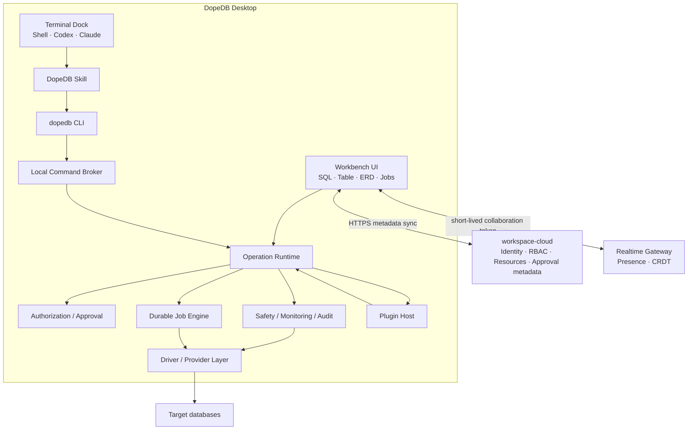
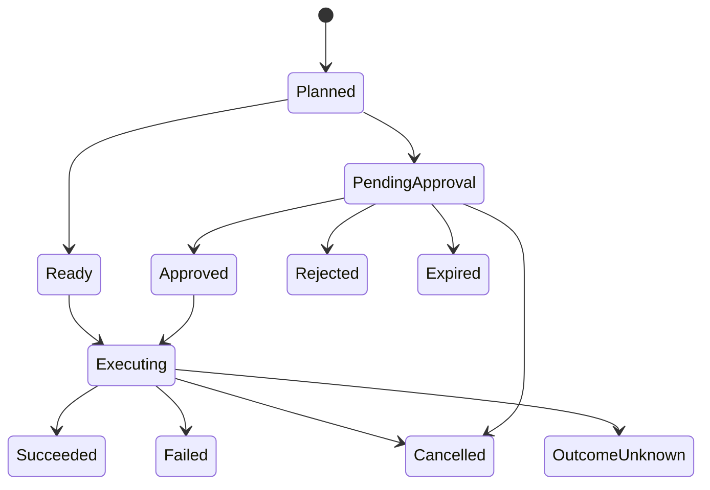

# DopeDB CLI·Terminal Platform 구현 계획

- 상태: 구현 진행 — Phase 3 Local Broker와 CLI
- 최종 갱신: 2026-07-24
- 적용 대상: DopeDB Desktop, `workspace-cloud`, 신규 `dopedb-cli`, 향후
  Plugin/Realtime 서비스

## 1. 문서 목적

이 문서는 DopeDB를 다음 제품 구조로 전환하기 위한 상세 구현 계획이다.

- 현재 인앱 Agent Chat을 PTY 기반 Terminal Dock으로 교체한다.
- Codex와 Claude Code가 설치된 DopeDB Skill을 통해 `dopedb` CLI를 사용하게 한다.
- 현재 MCP HTTP/stdio 전송 계층은 제거하되, MCP 내부에 구현된 쿼리 계획,
  read-only 실행, 모니터링, 감사 기능은 공용 Application Service로 보존한다.
- ERD/UML, 본격적인 Import/Export, SQL IDE, Table Management, Plugin,
  Team Collaboration을 같은 권한·승인·감사 경계 위에 구축한다.
- 모든 DB 자격증명과 실제 DB 실행은 계속 Rust core가 소유한다.

이 문서는 기능 아이디어 모음이 아니다. 단계별 선행 조건, 데이터 계약, 예상 파일,
마이그레이션, 검증 조건, 제거 조건을 정의하는 구현 기준 문서다.

## 2. 최종 제품 결정

### 2.1 최종 구조



### 2.2 변경하지 않는 신뢰 경계

- DB password, token, certificate, connection URL은 Rust core와 OS credential
  store 밖으로 내보내지 않는다.
- Agent, CLI, Plugin은 DB driver나 credential store를 직접 호출하지 않는다.
- 읽기 쿼리의 최종 방어선은 parser가 아니라 DB-enforced read-only session이다.
- 쓰기는 `allow_writes`, workspace 권한, DB credential 권한, exact proposal 승인
  모두가 허용해야 실행된다.
- local `app.db`와 target DB 사이에는 distributed transaction이 없으므로 target
  commit 직후 앱이 종료된 경우를 “exactly once”라고 표현하지 않는다.
- Workspace service는 DB proxy가 아니다.
- Query result row는 명시적인 masked snapshot 발행 전에는 cloud로 동기화하지 않는다.

### 2.3 주요 설계 결정

| 항목 | 결정 |
| --- | --- |
| Agent UI | 기존 Agent Chat Dock을 Terminal Dock으로 교체 |
| Terminal 위치 | Workbench 문서가 아니라 SQL/ERD와 동시에 볼 수 있는 utility dock |
| CLI 바이너리 | GUI 바이너리와 분리된 경량 `dopedb-cli` sidecar |
| CLI 실행 경계 | 실행 중인 DopeDB Runtime에 local IPC로 요청 |
| IPC | Unix domain socket / Windows named pipe, loopback HTTP 미사용 |
| 승인 | frontend가 넘기는 `approved: bool` 폐기, 저장된 exact Operation 승인 |
| Agent 승인 권한 | 없음. Agent/CLI는 proposal 생성과 상태 대기만 가능 |
| Skill | 앱에 bundle하고 첫 실행에서 명시적인 one-click 설치 |
| Skill 지침 | 작은 설치 stub + CLI가 출력하는 version-matched full guide |
| ERD/Table 선행 작업 | Catalog V2와 dialect-neutral DDL IR |
| Import/Export | 일회성 함수가 아니라 durable Job Engine |
| Plugin | Skill, WASI Component, signed sidecar, declarative UI |
| 동적 Rust library | 지원하지 않음 |
| 실시간 협업 | SQL text에 CRDT 우선 적용, 별도 WebSocket Realtime Gateway |
| MCP | 공용 service parity 확보 후 HTTP/stdio transport와 설정 UI 제거 |

## 3. 현재 코드 기준선

### 3.1 Rust core

- `src-tauri/src/lib.rs`
  - 앱 시작 시 MCP HTTP listener와 stdio bridge listener를 기동한다.
  - Tauri invoke handler가 UI 명령, MCP 상태, Agent Chat을 함께 노출한다.
- `src-tauri/src/mcp/tools.rs`
  - `list_connections`, `list_tables`, `describe_table`
  - `plan_query`, `run_query`
  - `run_document_query`, `create_dashboard`
  - 현재 가장 강한 Agent용 read safety 계약이 이 모듈에 결합되어 있다.
- `src-tauri/src/commands/mod.rs`
  - UI용 classify, preview, execute, script, table edit, MCP/Agent 명령이 한 파일에
    집중되어 있다.
  - write 실행에서 caller가 전달한 `approved: bool`을 사용한다.
- `src-tauri/src/agent/mod.rs`
  - turn마다 Codex/Claude CLI를 새로 실행한다.
  - stdin은 닫혀 있고 stdout JSONL을 파싱한다.
  - 진짜 PTY/TUI session이 아니다.
- `src-tauri/src/safety/`
  - SQL parse/classification
  - DB-enforced read-only
  - EXPLAIN 및 execute/rollback preview
  - approval policy decision
- `src-tauri/src/executor/`
  - read/write 실행과 cancel/timeout
- `src-tauri/src/introspect/`
  - 현재 Catalog는 ERD와 본격적인 DDL editor에 필요한 metadata가 부족하다.
- `src-tauri/src/store/`
  - local SQLite schema와 workspace/outbox/history/audit/chat 데이터를 소유한다.

### 3.2 Frontend

- `src/App.tsx`
  - Workbench document와 persistent Agent utility dock을 함께 관리한다.
- `src/lib/workbenchDocuments.ts`
  - data, schema, activity, sql, documents 문서 타입을 관리한다.
- `src/screens/AgentChat/`
  - 새 Terminal Dock으로 교체할 대상이다.
- `src/screens/Sql/`, `src/components/SqlViewer.tsx`
  - 현재 CodeMirror SQL editor의 확장 기반이다.
- `src/screens/Tables/`, `src/components/RowEditor.tsx`
  - staged row editing으로 확장할 기반이다.
- `src/screens/Schema/`
  - 현재 간단한 관계선을 보여주지만 drag/layout 저장/대형 schema 처리를 갖춘 완성형
    ERD engine은 아니다.
  - Catalog V2와 ERD 진입점으로 확장한다.
- `src/lib/export.ts`
  - 현재 frontend가 보유한 result page를 Blob으로 저장하는 범위다.
  - 전체 table/database streaming export의 기반으로 확장하지 않고 Rust Job Engine으로
    교체한다.
- `src/lib/queries.ts`, `src/lib/queryClient.tsx`
  - backend read state와 event-driven invalidation을 유지한다.

### 3.3 Workspace control plane

- `workspace-cloud/lib/schema.ts`
  - Better Auth identity/organization
  - workspace profile
  - shared connection template
  - provider integration과 credential lease
- 현재 local `sync_outbox.payload_json`은 hosted resource sync가 구현될 때까지 비어
  있으므로 collaboration sync가 완료된 것으로 간주하지 않는다.
- `docs/WORKSPACE_ROADMAP.md`
  - local execution, hosted control plane, member-local/managed credential 원칙을
    유지한다.

## 4. 구현 원칙

### 4.1 하나의 Operation Runtime

UI, CLI, Agent, Plugin마다 DB 실행 경로를 별도로 만들지 않는다.

```text
UI command ─────┐
CLI request ────┼─> Operation Runtime ─> Authorization ─> Safety ─> Executor
Plugin request ─┘
```

각 adapter는 입력을 Operation request로 변환할 뿐이다. 분류, policy, preview,
승인, 실행, audit은 한 번만 구현한다.

### 4.2 Exact payload 승인

승인은 “이 사용자가 쓰기를 허용했다”는 boolean이 아니라 다음 조합에 대해 부여한다.

```text
workspace + connection + actor + operation kind
+ canonical payload hash + policy snapshot + expiry
```

승인 후 payload가 바뀌면 기존 승인은 사용할 수 없다.

### 4.3 Connection을 암묵적으로 선택하지 않음

- JSON/script mode에서는 connection id를 요구한다.
- 사람용 selector는 `id:`, `name:`을 지원하되 이름은 유일할 때만 허용한다.
- 인앱 Terminal session이 한 connection에 고정된 경우에만 `current`를 허용한다.
- “첫 번째 연결” fallback은 제거한다.

### 4.4 Agent와 로컬 사용자를 구분

- 같은 OS user가 실행하더라도 Agent session에는 connection/capability scope를 적용한다.
- Agent는 read plan/run과 proposal 생성은 가능하다.
- Agent는 approval, credential export, raw provider token 조회가 불가능하다.
- 첫 release의 DB 접근 CLI는 인앱 Terminal session에서만 허용한다.
- 외부 shell에서는 version/status/app open/Skill 관리까지만 session 없이 허용한다.
- 외부 DB 접근은 후속 `dopedb session` 흐름에서 앱 승인을 받은 단기 shell/Agent
  session으로만 제공한다.

### 4.5 고용량 데이터와 제어 메시지 분리

- Local Broker는 작은 versioned control message를 처리한다.
- Terminal byte stream은 별도 Tauri Channel을 사용한다.
- Import/Export 대용량 데이터는 Job worker와 파일/stream handle을 사용한다.
- Result row 전체를 Tauri event나 broker JSON에 무제한으로 싣지 않는다.

## 5. Operation Runtime 상세 설계

### 5.1 모듈 구조

```text
dopedb-protocol/
  src/
    lib.rs
    request.rs
    response.rs
    error.rs
    version.rs

src-tauri/src/
  services/
    mod.rs
    connection_service.rs
    catalog_service.rs
    query_service.rs
    dashboard_service.rs
    document_service.rs
  operations/
    mod.rs
    model.rs
    canonicalize.rs
    policy.rs
    preview.rs
    approval.rs
    execute.rs
    state_machine.rs
    repository.rs
  broker/
    mod.rs
    protocol.rs
    server.rs
    peer.rs
    session.rs
    dispatch.rs
  terminal/
  skills/
  jobs/
  ddl/
  plugins/
```

`commands/mod.rs`와 `mcp/tools.rs`에 있는 business logic을 먼저 `services/`와
`operations/`로 옮긴다. Tauri command와 MCP adapter는 전환 기간에 이 service를
호출한다.

### 5.2 Operation 종류

```rust
enum OperationKind {
    ReadQuery,
    DocumentRead,
    WriteSql,
    Ddl,
    Privilege,
    SqlScript,
    TableDataChange,
    SchemaChange,
    Import,
    Export,
    Migration,
    DashboardCreate,
    PluginAction,
    ProviderAction,
}
```

### 5.3 Actor 종류

```rust
enum OperationActorKind {
    LocalUser,
    WorkspaceUser,
    Agent,
    Plugin,
    System,
}
```

Actor에는 다음 provenance를 함께 저장한다.

- local account/workspace account
- terminal session
- Agent provider와 model, 알 수 있는 경우
- Plugin id/version
- client protocol version
- origin UI surface

### 5.4 상태 머신

`Draft`는 frontend 편집 상태일 뿐 local store에는 기록하지 않는다. 저장되는 첫
상태는 `Planned`다.



허용 transition은 Rust state machine 한 곳에서 검사한다. UI나 CLI가 임의 state를
지정하지 않는다.

취소 요청을 보냈다는 이유만으로 즉시 `Cancelled`로 기록하지 않는다.

- target DB가 rollback/중단을 확인한 경우: `Cancelled`
- commit 여부를 확인할 수 없는 상태에서 process/app가 종료된 경우:
  `OutcomeUnknown`
- `OutcomeUnknown`은 자동 재실행하지 않고 사용자가 target 상태를 확인한 후
  reconcile한다.

### 5.5 Local store 테이블

#### `operations`

| 필드 | 용도 |
| --- | --- |
| `id` | UUID |
| `runtime_id` | 이전 앱 실행에서 만들어진 stale plan 실행 방지 |
| `workspace_id` | resource/권한 scope |
| `account_scope` | personal 또는 authenticated account |
| `connection_id` | target connection |
| `connection_revision` | 계획 이후 connection/policy 교체 감지 |
| `terminal_session_id` | Agent session provenance |
| `actor_kind` | local_user/workspace_user/agent/plugin/system |
| `actor_id` | user/plugin/provider 식별자 |
| `operation_kind` | read/write/ddl/import/... |
| `payload_schema_version` | canonical payload version |
| `payload_json` | immutable canonical request |
| `payload_hash` | SHA-256 |
| `schema_fingerprint` | 계획 시점 target schema |
| `risk_level` | low/medium/high/critical |
| `preview_json` | EXPLAIN, affected estimate, file summary |
| `policy_snapshot_json` | 계획 당시 권한·safety decision |
| `state` | current projection |
| `single_use` | plan 재사용 방지 |
| `idempotency_key` | 중복 실행 방지 |
| `expires_at` | plan/approval expiry |
| `created_at`, `updated_at` | timestamps |

규칙:

- `payload_json`, `payload_hash`, connection, operation kind는 insert 후 수정 금지다.
- SQLite trigger로 immutable field update를 차단한다.
- `(workspace_id, actor_kind, actor_id, idempotency_key)` unique index를 둔다.
- connection에는 cascade foreign key를 걸지 않는다. 연결이 삭제되어도 operation
  provenance가 남아야 한다.
- 앱 시작 시 이전 `runtime_id`의 non-terminal short plan은 expired 처리한다.
- 이전 실행에서 `Executing`으로 남은 mutation은 `OutcomeUnknown`으로 복구한다.
- resumable Job은 별도 checkpoint 검증 후 재개한다.

#### `operation_approvals`

| 필드 | 용도 |
| --- | --- |
| `id` | approval UUID |
| `operation_id` | exact operation |
| `payload_hash` | 승인 화면에서 본 hash |
| `approver_kind` | local/workspace |
| `approver_id` | local-user 또는 workspace user |
| `decision` | approved/rejected |
| `reason` | rejection/approval note |
| `policy_revision` | team policy revision |
| `created_at`, `expires_at` | timestamps |

#### `operation_events`

append-only event ledger다.

- proposed
- planned
- approval_requested
- approved
- rejected
- execution_started
- progress
- succeeded
- failed
- cancelled
- outcome_unknown
- expired

이 테이블은 UI 상태 복구용 projection source다. Compliance 목적의 기존 hash-chained
`audit_log`도 별도로 유지한다.

`operation_events` 역시 `prev_hash`와 `hash`를 가져 lifecycle 변조를 탐지한다.
기존 `audit_log` row format을 변경하면 과거 chain 검증이 깨질 수 있으므로 새 ledger를
별도로 추가한다.

### 5.6 내부 Execution Grant

`executor`가 boolean approval을 다시 받지 않도록 외부에서 생성할 수 없는 Rust
capability를 사용한다.

```rust
pub(crate) struct ExecutionGrant {
    operation_id: Uuid,
    payload_sha256: String,
    connection_id: Uuid,
}
```

- 생성자는 `operations::execute` 내부 private다.
- `executor::run_write`와 write script path는 `&ExecutionGrant` 없이는 호출할 수 없다.
- frontend와 CLI는 execution 시 SQL을 다시 전달하지 않는다.
- Runtime이 `operations.payload_json`에서 exact payload를 다시 읽는다.

실행 claim은 compare-and-swap으로 원자화한다.

```sql
UPDATE operations
SET state = 'executing', started_at = CURRENT_TIMESTAMP
WHERE id = ?
  AND state IN ('ready', 'approved')
  AND payload_hash = ?
  AND (expires_at IS NULL OR expires_at > CURRENT_TIMESTAMP);
```

`rows_affected() == 1`인 caller만 target DB에 접근한다.

### 5.7 읽기 흐름

```text
query plan
  1. connection/workspace scope 검사
  2. SQL 한 문장 parse/classify
  3. read-only 종류 확인
  4. schema fingerprint 기록
  5. EXPLAIN
  6. aggregate monitoring snapshot
  7. max rows/cell/bytes cap 결정
  8. single-use plan 저장

query run
  1. plan id만 입력받음
  2. runtime/TTL/single-use/state 검사
  3. connection과 SQL을 plan에서 로드
  4. 재분류
  5. DB-enforced read-only session 실행
  6. history/audit 기록
  7. plan 소비 처리
```

추가 규칙:

- plan에는 owner principal, terminal session, workspace/account scope,
  connection revision을 저장한다.
- plan을 만든 session만 소비할 수 있다.
- workspace switch, connection update/delete, role revoke 시 관련 plan을 폐기한다.
- `run` 요청에는 SQL이나 connection을 다시 받지 않는다.

### 5.8 쓰기 흐름

```text
sql propose
  1. canonical SQL과 connection을 저장
  2. workspace access, allow_writes, environment policy 검사
  3. classification과 preview
  4. proposal hash 생성
  5. pending_approval

UI approve
  1. UI는 operation id와 화면에 표시한 hash만 전달
  2. Rust가 현재 저장된 hash/expiry/policy revision 재검사
  3. approval append
  4. Runtime이 저장된 exact payload를 직접 실행
```

CLI에는 `approve` 명령을 제공하지 않는다.

실행 직전 다시 검사한다.

- workspace/account scope
- operation state와 expiry
- payload hash
- connection revision
- 현재 workspace membership/grant
- 현재 credential capability
- 현재 safety policy
- stored SQL 재분류 결과
- production 추가 정책

정책이 proposal 이후 완화됐다는 이유만으로 기존 proposal의 권한이 넓어지지 않는다.

### 5.9 target commit과 local receipt의 한계

target DB와 local SQLite를 하나의 transaction으로 묶을 수 없다.

```text
local execute-attempt 기록
  → target DB 실행/commit
  → local execution receipt 기록
```

target commit과 local receipt 사이에서 앱이 죽을 수 있다.

- target 접근 전에 durable `execute_attempt` event를 기록한다.
- 정상 종료 후 success/failure receipt를 기록한다.
- 시작 시 남아 있는 `Executing` mutation은 자동 retry하지 않는다.
- local idempotency key는 중복 claim을 막지만 target commit 여부까지 증명하지 않는다.
- UI는 `OutcomeUnknown`에서 target 상태 확인과 수동 reconcile을 안내한다.

### 5.10 승인 정책

기본 정책:

| 조건 | 요구 사항 |
| --- | --- |
| read, dev/staging | plan/run |
| read, prod | health warning 확인 후 plan/run |
| write/DDL | local explicit approval |
| prod write/DDL | typed confirmation + approval |
| no-WHERE update/delete | critical risk, 별도 typed phrase |
| privilege | 기본 block, 제한된 공식 operation만 허용 |
| import replace/truncate | critical approval |
| export prod/민감 컬럼 | data disclosure approval |
| plugin write | Plugin permission + operation approval |
| team production | workspace approval policy + local exact execution |

`require_approval=false`와 같은 legacy 설정은 manual read UX에만 제한적으로 호환한다.
Agent/Plugin-origin write와 DDL은 항상 exact proposal을 요구한다.

L3 execute+rollback preview도 무해한 작업으로 취급하지 않는다. rollback-safe DML도
trigger, NOTIFY 또는 외부 side effect를 발생시킬 수 있으므로 Agent proposal의 기본
preview는 EXPLAIN이고, execute-preview는 별도 명시 정책이 있을 때만 사용한다.

## 6. Local Broker와 CLI

### 6.1 CLI crate

```text
Cargo.toml
dopedb-protocol/
  Cargo.toml
  src/
    lib.rs
    request.rs
    response.rs
    error.rs
    version.rs
dopedb-cli/
  Cargo.toml
  src/
    main.rs
    args.rs
    client.rs
    protocol.rs
    output.rs
    exit_code.rs
    commands/
      app.rs
      skills.rs
      connection.rs
      catalog.rs
      query.rs
      operation.rs
      jobs.rs
      plugins.rs
```

Desktop Runtime과 CLI가 서로 protocol type을 복제하지 않도록 `dopedb-protocol`
crate를 함께 사용한다. 이 crate에는 transport, DB, Tauri dependency를 넣지 않는다.

CLI crate에는 다음 dependency를 넣지 않는다.

- `sqlx`
- `mongodb`
- `keyring`
- provider credential 발급 구현
- Tauri webview

### 6.2 IPC transport

#### macOS/Linux

- platform app-data runtime directory
- Unix domain socket
- runtime directory와 socket은 현재 사용자만 접근
- 가능한 플랫폼에서는 peer UID를 확인

#### Windows

- random runtime id를 포함한 named pipe
- 현재 사용자 SID에만 접근 허용
- pipe client identity를 검증

#### Runtime discovery

앱은 mode `0600`에 해당하는 권한으로 `runtime.json`을 기록한다.

```json
{
  "schemaVersion": 1,
  "runtimeId": "uuid",
  "pid": 1234,
  "appVersion": "<app-version>",
  "protocolMin": 1,
  "protocolMax": 1,
  "endpoint": "platform-specific endpoint",
  "startedAt": "..."
}
```

secret이나 DB 정보는 포함하지 않는다.

### 6.3 Message framing

- control message는 length-prefixed JSON을 사용한다.
- NDJSON은 payload 내 개행, partial read, 큰 응답 경계 문제 때문에 broker framing으로
  사용하지 않는다.
- 최대 request/response byte, JSON nesting, collection length를 제한한다.
- protocol version과 command schema version을 분리한다.

```json
{
  "protocolVersion": 1,
  "requestId": "uuid",
  "session": "opaque-session-id",
  "command": "query.plan",
  "arguments": {}
}
```

```json
{
  "protocolVersion": 1,
  "requestId": "uuid",
  "ok": false,
  "error": {
    "code": "policy_blocked",
    "message": "...",
    "retryable": false,
    "details": {}
  }
}
```

### 6.4 인증과 Terminal-scoped session

Terminal session 생성 시 Rust core가 다음을 만든다.

- terminal session id
- active workspace id
- pinned connection id
- capability set
- 256-bit opaque capability
- expiry/rotation 정보

capability는 broker memory에만 저장하고 PTY environment에 전달한다.

```text
DOPEDB_RUNTIME_FILE=<path>
DOPEDB_TERMINAL_SESSION_ID=<uuid>
DOPEDB_CONNECTION_SCOPE=<uuid>
DOPEDB_SESSION_TOKEN=<ephemeral-opaque-capability>
```

이 token은 DB credential이 아니며 Terminal 종료, workspace membership/grant 변경,
connection 삭제 시 즉시 revoke한다. argv, CLI JSON, log에는 출력하지 않는다.

같은 OS user의 악성 process를 완전히 방어하는 경계라고 주장하지 않는다. 목적은
Agent session 오작동, connection 혼선, 다른 Terminal의 plan 재사용을 방지하는 것이다.

첫 release에서는 DB 관련 broker command에 이 session capability를 필수로 요구한다.
전역 discovery file에 bootstrap token을 저장하지 않는다.

외부 OS Terminal 지원은 후속 단계로 분리한다.

```text
dopedb session start --connection id:<uuid> --shell
dopedb session start --connection id:<uuid> --agent codex
```

이 명령은 앱에서 사용자 승인을 받은 후 CLI가 단기 token을 가진 child shell/Agent를
직접 시작한다. token을 출력하거나 shell profile에 저장하지 않는다.

### 6.5 CLI selector

```text
id:<uuid>
name:<exact-name>
current
```

- `current`는 pinned Terminal session에서만 허용한다.
- name이 중복되면 후보를 반환하고 실패한다.
- automation과 Skill guide는 UUID 사용을 권장한다.

### 6.6 CLI 출력

- 모든 Agent용 명령은 `--json`을 지원한다.
- JSON field 제거/의미 변경은 protocol major 변경 없이 하지 않는다.
- human output과 JSON serializer를 분리한다.
- stderr에는 진단만, stdout에는 요청한 결과만 출력한다.
- password, token, certificate, raw connection URL을 출력하지 않는다.
- 큰 cell과 전체 결과 byte cap을 둔다.

Exit code:

| 코드 | 의미 |
| ---: | --- |
| 0 | 성공 |
| 2 | argument/usage 오류 |
| 3 | Runtime unavailable |
| 4 | authentication/scope denied |
| 5 | policy blocked |
| 6 | operation expired/conflict |
| 7 | cancelled/timeout |
| 8 | target execution failed |
| 9 | protocol/version mismatch |
| 10 | internal error |

### 6.7 CLI 명령 1차 범위

```text
dopedb version --json
dopedb status --json
dopedb app open --wait --json

dopedb skills list [--json]
dopedb skills get dopedb-cli [--full] [--json]
dopedb skill status --target all --json
dopedb skill install --target codex|claude-code|all --json
dopedb skill repair --target ... --json
dopedb skill remove --target ... --json

dopedb connection list --json
dopedb connection show <selector> --json
dopedb connection test <selector> --json

dopedb catalog show --connection <selector> --json
dopedb schema list --connection <selector> --json
dopedb table describe <qualified-table> --connection <selector> --json

dopedb query plan --connection <selector> --file - --json
dopedb query run --plan <uuid> --json
dopedb query cancel <uuid> --json

dopedb sql propose --connection <selector> --file - --json
dopedb operation show <uuid> --json
dopedb operation wait <uuid> --timeout-ms <n> --json
dopedb operation cancel <uuid> --json
```

Import/Export와 Plugin 명령은 해당 Runtime phase에서 추가한다.

### 6.8 CLI 설치

앱 bundle에는 target별 `dopedb-cli` sidecar를 포함한다.

- 인앱 Terminal의 `PATH`에는 bundle의 CLI directory를 항상 prepend한다.
- 따라서 global PATH 설치 없이도 인앱 Agent가 `dopedb`를 찾을 수 있다.
- 외부 shell 사용자는 Settings에서 별도 “Install CLI”를 실행한다.
- global CLI를 설치해도 DB command는 승인된 session 밖에서 실행되지 않는다.
- 시스템 경로를 무단 수정하지 않는다.

권장 경로:

- macOS/Linux: `~/.local/bin/dopedb`
- Windows: `%LOCALAPPDATA%\DopeDB\bin\dopedb.exe`

PATH에 없으면 exact 수정 내용을 보여주고 동의를 받는다. `/usr/local/bin`처럼 권한이
필요한 위치는 사용자가 선택한 경우에만 사용한다.

## 7. Skill Bundle과 설치 관리자

### 7.1 source layout

```text
skills/
  dopedb-cli/
    SKILL.md
    references/
      safety.md
      queries.md
      operations.md
src-tauri/resources/skills/
  current-manifest.json
  snapshot-registry.json
  release-mapping.json
scripts/
  generate-skill-bundle.mjs
```

설치되는 `SKILL.md`는 discovery stub이다.

```text
Before using DopeDB, run:
dopedb skills get dopedb-cli
```

full guide는 실행 중인 CLI에 embed하여 `dopedb skills get`이 출력한다.

### 7.2 manifest

각 Skill revision에 다음을 기록한다.

- skill name
- release revision
- source path
- app version
- package digest
- file path
- file size
- executable 여부
- exact SHA-256
- normalized-text SHA-256

### 7.3 설치 상태

```rust
enum SkillInstallState {
    Missing,
    ManagedCurrent,
    ManagedOlder,
    UserModified,
    NewerKnown,
    UnknownConflict,
    Invalid,
}
```

### 7.4 설치 규칙

- Codex와 Claude Code별 install-root adapter를 둔다.
- root 경로, symlink, path traversal을 검증한다.
- staging directory에서 전체 package를 만든 뒤 atomic rename한다.
- DopeDB가 설치한 known snapshot만 자동 교체한다.
- user-modified/unknown 파일은 backup 없이 덮어쓰지 않는다.
- `repair`는 exact conflict를 보여주고 명시적 동의를 요구한다.
- 앱 update 후 focus/startup 시 bounded inventory scan을 실행한다.
- scan은 byte/file count/nesting limit을 적용한다.

### 7.5 온보딩 UX

첫 실행 Agent Tools 단계:

1. Codex/Claude Code 설치 여부 탐지
2. 인증 상태 탐지
3. Skill install target과 실제 경로 표시
4. `Install DopeDB Skill` 한 번의 동의
5. 설치 후 `dopedb skills get dopedb-cli` self-test
6. Terminal session 생성 smoke test

Skip할 수 있어야 하며 Settings에서 언제든 재실행할 수 있다.

## 8. PTY Terminal Dock

### 8.1 Rust module

```text
src-tauri/src/terminal/
  mod.rs
  model.rs
  manager.rs
  pty.rs
  process_tree.rs
  environment.rs
  output.rs
```

`AppState`에는 `TerminalManager`를 둔다.

```rust
struct TerminalManager {
    sessions: DashMap<Uuid, TerminalSession>,
}
```

각 session은 다음을 소유한다.

- PTY master
- child/process killer
- output reader task/thread
- bounded replay buffer
- size
- pinned connection/workspace
- agent profile
- lifecycle state

### 8.2 Tauri command/channel

Commands:

- `terminal_create`
- `terminal_list`
- `terminal_focus`
- `terminal_write`
- `terminal_resize`
- `terminal_kill`
- `terminal_restart`
- `terminal_rename`
- `terminal_shutdown_all`

고용량 output은 Tauri Channel을 사용한다. 상태 event 이름은 점을 쓰지 않는다.

- `terminal:state`
- `terminal:exit`
- `operation:changed`
- `job:progress`
- `skill:inventory`

### 8.3 Frontend 구조

```text
src/components/
  TerminalDock.tsx
  TerminalDock.css
  TerminalTabs.tsx
  TerminalSurface.tsx
  TerminalToolbar.tsx
src/lib/
  terminalSessions.ts
src/screens/Settings/AgentTools/
  index.tsx
  agentTools.css
```

기존 `AgentChatProvider`와 `AgentFeedProvider`는 Terminal state와 Operation activity로
교체한다.

### 8.4 Dock UX

- 첫 구현은 현재 Agent utility dock의 right-side grid/focus 구조를 재사용한다.
- 최소 폭 360px, 최대 720px 또는 viewport 55%
- drag resize와 마지막 폭 저장
- 후속 단계에서 right/bottom 위치 선택
- maximize/restore
- session tabs
- Shell/Codex/Claude 생성 메뉴
- connection/environment chip
- read/write policy chip
- Skill 상태
- exit/restart
- operation/job activity badge

연결 전환 규칙:

- session은 생성 시 connection에 pin한다.
- Workbench connection을 바꿔도 기존 session scope는 유지한다.
- 서로 다르면 명확한 mismatch banner를 표시한다.
- 사용자는 현재 connection으로 새 session을 만들거나 clone한다.
- 기존 session을 조용히 retarget하지 않는다.

### 8.5 Agent profile

현재 `agent/claude.rs`, `agent/codex.rs`의 설치/인증/model 탐지는 재사용하되 turn별
JSONL 실행 코드는 제거한다.

```rust
struct AgentLaunchProfile {
    provider: AgentProvider,
    executable: PathBuf,
    args: Vec<String>,
    model: Option<String>,
    effort: Option<String>,
    cwd: PathBuf,
}
```

- 기본 cwd는 DopeDB neutral workspace다.
- 사용자가 명시적으로 project directory를 연결할 수 있다.
- app bundle directory나 credential directory를 cwd로 사용하지 않는다.
- CLI 경로만 PATH에 추가한다.

### 8.6 Terminal 보안

- OSC 52 clipboard는 기본 비활성 또는 명시적 허용
- terminal-controlled window operation 제한
- link는 opener allowlist/확인 후 외부 열기
- untrusted escape sequence가 DOM/HTML을 주입할 수 없게 한다.
- PTY 환경에서 DopeDB secret을 제거한다.
- output replay buffer에 byte/line cap을 둔다.
- output은 UTF-8 string으로 성급히 변환하지 않고 byte sequence를 보존해 xterm에
  8~16KiB 단위로 전달한다.
- bounded channel과 sequence number로 backpressure/replay를 관리한다.
- Terminal output을 기본 영구 저장하지 않는다.
- Unix에서는 별도 process group을 만들고 `killpg`까지 수행한다.
- Windows에서는 Job Object에 child를 할당하고 descendant까지 정리한다.
- `portable-pty::Child::kill()`이 process tree 전체를 종료한다고 가정하지 않는다.
- 앱 종료 시 capability를 먼저 revoke하고 child process tree를 bounded wait 후 종료한다.
- Windows ConPTY와 macOS PTY를 CI/manual matrix에서 검증한다.

### 8.7 기존 Agent Chat 데이터

- 첫 Terminal release에서는 기존 chat table을 읽기 전용 archive로 유지한다.
- UI에서 “Previous Agent Conversations” export/read만 제공할 수 있다.
- 최소 한 번의 안정 release가 지난 뒤 별도 migration에서 삭제 여부를 결정한다.
- 사용자 대화를 자동 삭제하지 않는다.

## 9. MCP 전환과 제거

### 9.1 전환 단계

1. `mcp/tools.rs` business logic을 `services/`로 이동
2. MCP adapter가 새 service를 호출하게 변경
3. Local Broker/CLI adapter가 같은 service를 호출
4. golden parity test 작성
5. Terminal과 Skill 기본 경로 활성화
6. MCP 설정에 deprecation 안내
7. 기존 client config cleanup 도구 제공
8. HTTP/stdio listeners 비활성
9. 한 안정 release 후 code/dependency/sidecar 제거

### 9.2 parity 기준

- connection list 결과의 secret redaction
- Catalog/table describe
- mandatory query plan/run
- plan TTL과 single-use
- EXPLAIN/monitoring warning
- DB-enforced read-only
- result cap
- history/audit
- dashboard provenance
- Mongo typed read-only query

### 9.3 제거 대상

- `src-tauri/src/mcp/`
- `dopedb-mcp-stdio/`
- `Settings/Mcp`
- MCP onboarding
- MCP badge
- ports 7686/7687
- `mcp.json`
- platform MCP config write helpers
- `rmcp`
- MCP 전용 `axum` 사용
- bridge build/staging script
- Tauri `externalBin`의 MCP bridge entry

`schemars`가 MCP 외의 typed schema에 계속 쓰인다면 유지한다.

### 9.4 client config cleanup

- Claude/Codex config의 DopeDB entry를 read-only로 탐지한다.
- 자동 삭제 전에 exact file과 변경 diff를 보여준다.
- backup을 만든 뒤 DopeDB entry만 제거한다.
- 다른 MCP entry나 사용자 formatting을 보존한다.
- cleanup 실패가 새 Terminal/CLI 사용을 막지는 않게 한다.

## 10. Catalog V2

### 10.1 목표

ERD, schema diff, autocomplete, Table Editor, DDL proposal이 동일한 catalog snapshot을
사용하게 한다.

### 10.2 계약

```rust
struct CatalogSnapshot {
    schema_version: u32,
    connection_id: Uuid,
    engine: Engine,
    database: String,
    captured_at: DateTime<Utc>,
    fingerprint: String,
    namespaces: Vec<Namespace>,
    relations: Vec<Relation>,
    routines: Vec<Routine>,
    other_objects: Vec<DatabaseObject>,
}
```

#### `ObjectRef`

- catalog
- schema/namespace
- name
- object kind
- engine-native stable id가 안전하게 노출 가능한 경우 optional id

#### Column

- ordinal
- native type
- normalized type family
- length/precision/scale
- nullable
- default expression
- generated expression
- identity/auto increment
- collation
- comment
- sensitivity annotation

#### Constraint

- primary
- unique
- foreign
- check
- column list
- referenced relation/columns
- update/delete action
- deferrable
- validation state

#### Index

- name
- method
- key columns/expressions
- sort direction
- included columns
- predicate
- unique
- validity

#### Relation

- table/view/materialized view
- comment
- row estimate
- partition parent/children
- columns
- constraints
- indexes

### 10.3 cache migration

- `schema_cache`에 `catalog_schema_version`, `fingerprint`, `captured_at`을 명시한다.
- old JSON은 best-effort deserialize하지 않고 version mismatch 시 lazy refresh한다.
- connection edit/driver change/provider lease rotation 시 cache invalidation 규칙을 유지한다.
- 큰 catalog에 size cap과 compression 도입 여부를 측정한다.

### 10.4 fingerprint

canonical object ordering과 normalized metadata로 SHA-256을 만든다.

사용처:

- ERD layout reconciliation
- schema diff
- DDL proposal stale detection
- Import mapping stale detection
- shared resource provenance

## 11. Dialect-neutral DDL IR

### 11.1 목적

Table/ERD UI가 SQL 문자열을 직접 조립하지 않도록 한다.

```rust
enum SchemaChange {
    CreateTable(...),
    RenameTable(...),
    AddColumn(...),
    AlterColumn(...),
    DropColumn(...),
    AddConstraint(...),
    DropConstraint(...),
    CreateIndex(...),
    DropIndex(...),
}
```

### 11.2 renderer

```text
src-tauri/src/ddl/
  mod.rs
  ir.rs
  validate.rs
  postgres.rs
  mysql.rs
  sqlite.rs
```

- PostgreSQL renderer
- MySQL/MariaDB renderer
- SQLite table rebuild planner
- unsupported capability는 fail closed
- quote/identifier handling은 engine adapter가 담당

### 11.3 실행

```text
structured edit
  → validate against Catalog V2
  → render SQL
  → classify/risk
  → preview
  → Operation Proposal
  → approval
  → exact SQL execution
  → refresh catalog
```

## 12. SQL IDE

### 12.1 저장 문서

새 local table `sql_documents`:

- id
- workspace/connection
- title
- dialect
- content
- local revision
- remote id/revision
- dirty/sync/conflict state
- created/updated timestamps

현재 in-memory `WorkbenchDocument`의 draft를 autosave 가능한 document id와 연결한다.

### 12.2 editor 기능

1차:

- multiple SQL documents
- autosave/crash recovery
- selection/current statement/all 실행
- formatter
- schema-aware completion
- snippets
- search/replace
- command palette
- configurable shortcuts
- cancel
- multiple result sets
- result pin
- history/favorites

2차:

- parameter binding
- hover metadata
- dialect diagnostics
- EXPLAIN tree
- plan comparison
- transaction state
- commit/rollback UX
- result comparison

### 12.3 command registry

단축키와 menu action을 별도 registry로 통합한다.

Scope:

- global
- workspace
- document
- SQL editor
- result grid
- Table editor
- ERD
- Terminal

요구 사항:

- conflict detection
- default/custom/disabled 상태
- per-command reset
- reset all
- OS별 display

### 12.4 Terminal bridge

- `Send selection to Terminal`
- `Explain error in Terminal`
- `Analyze plan in Terminal`
- `Generate safer query`
- `Propose editor patch`

Agent가 editor content를 직접 바꾸지 않는다.

```text
Agent patch proposal
  → exact before hash
  → diff preview
  → user applies
  → document revision update
```

## 13. Table Management

### 13.1 row identity

- PK 또는 non-null unique key가 있어야 기본 inline edit를 허용한다.
- key가 없으면 read-only로 표시한다.
- engine 임시 row locator를 일반 편집 identity로 사용하지 않는다.

### 13.2 staged change set

```rust
struct TableChangeSet {
    connection_id: Uuid,
    relation: ObjectRef,
    catalog_fingerprint: String,
    changes: Vec<RowChange>,
}
```

RowChange:

- insert
- update
- delete
- original key
- original concurrency values
- changed values

### 13.3 optimistic concurrency

우선순위:

1. 사용자/DB가 제공한 version column
2. key + 수정 대상 original value의 null-safe predicate
3. 일치 행이 0이면 conflict

충돌 시 자동 overwrite하지 않고:

- current DB row
- original row
- staged row

세 값을 비교한다.

### 13.4 데이터 편집 기능

- add/clone/delete row
- multi-cell paste
- NULL/default
- copy as INSERT/UPDATE/JSON/CSV/TSV
- staged validation
- per-row error
- batch transaction
- rollback
- conflict retry
- filter/sort builder

### 13.5 구조 편집 기능

- create/rename/drop table
- add/rename/alter/drop column
- PK/FK/unique/check
- index
- comment
- engine options
- truncate
- copy table

모두 DDL IR과 Operation Proposal을 사용한다.

## 14. ERD/UML

### 14.1 frontend

```text
src/screens/ERD/
  index.tsx
  erd.css
src/components/
  ErdCanvas.tsx
  ErdRelationNode.tsx
  ErdEdge.tsx
  ErdToolbar.tsx
src/lib/
  erdGraph.ts
  erdLayout.ts
  erdPersistence.ts
```

예상 library:

- `@xyflow/react`
- `elkjs`

dependency 도입 시 repository의 최신 안정판 정책과 supply-chain 검증을 적용한다.

### 14.2 표시 모드

- physical ERD
- logical ERD
- database UML class notation

세 모드는 동일한 graph model의 presentation이다.

### 14.3 edge

- 실제 FK: solid
- workspace virtual relation: dashed
- inference relation: dotted, 기본 off
- composite FK
- cardinality
- self relation
- cross-schema relation

가상 관계를 그리는 행위는 DB FK 생성이 아니다. “Convert to DB constraint”를 선택한
경우에만 DDL proposal을 만든다.

### 14.4 layout/persistence

`erd_layouts`:

- workspace/connection
- catalog fingerprint
- layout name
- node positions
- collapsed state
- filters
- virtual relations
- revision/sync metadata

catalog가 바뀌면 stable object ref로 기존 node 위치를 재사용하고 신규 node만
incremental layout한다.

### 14.5 대형 schema

- 100개 이상 relation은 compact/collapsed 기본값 검토
- viewport virtualization
- neighborhood N-hop focus
- schema cluster
- column lazy rendering
- ELK layout worker
- layout cancel

### 14.6 기능

- search/filter
- hide columns
- focus relation
- relationship path
- schema diff overlay
- open table/data/DDL/SQL
- send context to Terminal
- SVG/PNG/PDF export
- shared layout/revision

## 15. Import/Export Job Engine

### 15.1 module

```text
src-tauri/src/jobs/
  mod.rs
  model.rs
  repository.rs
  scheduler.rs
  worker.rs
  checkpoint.rs
  progress.rs
  artifact.rs
  import/
  export/
```

### 15.2 local tables

#### `jobs`

- id
- operation id
- kind
- workspace/connection
- immutable plan/hash
- state
- progress counters
- source/target summary
- resumable
- created/started/finished
- error code/redacted error

#### `job_checkpoints`

- job id
- sequence
- source fingerprint
- target fingerprint
- opaque checkpoint JSON
- created timestamp

#### `job_events`

- queued
- started
- progress
- warning
- paused
- resumed
- succeeded
- failed
- cancelled

#### `job_artifacts`

- job id
- type
- scoped local path
- size/hash
- retention state

### 15.3 internal data batch

UI result JSON과 data movement batch를 분리한다.

```rust
enum DataValue {
    Null,
    Bool(bool),
    Integer(String),
    Decimal(String),
    Float(f64),
    Text(String),
    Bytes(Vec<u8>),
    Json(serde_json::Value),
    Date(String),
    Time(String),
    Timestamp(String),
    Uuid(String),
    Document(serde_json::Value),
}
```

NUMERIC/DECIMAL은 문자열 정밀도를 보존한다. Plugin boundary가 준비되면 relational
batch에 Arrow IPC를 도입할 수 있으나 첫 Job Engine의 필수 조건은 아니다.

### 15.4 Export

1차 format:

- CSV
- TSV
- JSON
- NDJSON
- INSERT SQL
- schema DDL

2차:

- XLSX
- compressed archive
- engine bulk format

Scope:

- current result
- complete bounded result rerun
- table
- selected columns
- schema
- database
- structure/data/both

Export plan에는 consistency 수준을 표시한다.

- single read transaction snapshot
- per-batch current data
- engine이 제공하는 snapshot/export primitive

완성 파일 경로에 바로 쓰지 않고 같은 filesystem의 temporary artifact에 streaming한
뒤 flush/fsync와 성공 검증 후 atomic rename한다. 실패·취소된 partial file은
사용자에게 상태를 표시하고 안전하게 정리한다.

옵션:

- encoding
- delimiter/quote/header
- NULL representation
- timezone
- date/time format
- masking
- gzip
- batch size

### 15.5 Import

- preview first N rows
- encoding/delimiter/header detection
- column mapping
- type conversion
- append
- upsert
- skip conflict
- replace
- batch transaction
- per-row error artifact
- retry/resume/cancel

### 15.6 file capability

- UI file picker가 opaque file capability를 발급한다.
- Agent가 path를 제안한 경우 canonical path, file size, hash를 approval에 표시한다.
- export destination은 UI가 선택한다.
- Plugin/Agent에 일반 filesystem 권한을 주지 않는다.
- symlink와 path replacement race를 방어하기 위해 open handle과 metadata를 검증한다.

### 15.7 resume

- source file hash가 바뀌면 resume 불가
- target schema fingerprint가 바뀌면 재검토
- CSV/NDJSON은 byte/row checkpoint
- XLSX는 sheet/row checkpoint
- SQL script는 idempotency가 보장되지 않으면 자동 resume 금지
- export append resume는 format과 destination이 안전한 경우에만 허용

## 16. Plugin Platform

### 16.1 Plugin 유형

| 유형 | 실행 | 용도 |
| --- | --- | --- |
| Skill | Markdown/assets | Agent workflow |
| Transform | WASI Component | format/transform/generator |
| Driver | signed sidecar | DB protocol |
| Provider | signed sidecar | cloud control plane |
| UI | declarative schema | 설정, progress, result |

### 16.2 manifest

```toml
schema_version = 1
id = "dev.dopedb.example"
name = "Example"
version = "1.0.0"
publisher = "..."
min_app_version = "..."
max_protocol_version = 1

entrypoints = ["wasi-transform"]
capabilities = [
  "catalog.read",
  "data.stream.read",
  "file.write.selected"
]
```

Artifact별:

- platform/arch
- path
- size
- SHA-256
- signature
- protocol range

### 16.3 capability

```text
catalog.read
query.plan
operation.propose
data.stream.read
data.stream.write
file.read.selected
file.write.selected
network.domain:<host>
workspace.resource.read
workspace.resource.write
```

Plugin에는 raw credential이나 unrestricted filesystem/network를 주지 않는다.

### 16.4 설치

```text
catalog/download
  → manifest schema 검증
  → publisher/signature/hash 검증
  → permission review
  → staging
  → self-test
  → atomic activate
  → previous version retention
  → rollback
```

### 16.5 lifecycle

- installed
- enabled per workspace
- disabled
- update available
- incompatible
- quarantined
- rollback available

Crash/timeout이 app process를 손상하지 않아야 한다. Sidecar process tree와 resource
budget을 관리한다.

Local store:

- `plugin_installations`
- `plugin_versions`
- `plugin_permissions`
- `plugin_activation_events`

### 16.6 UI extension

첫 버전은 declarative form/table/progress schema만 허용한다.

- arbitrary React bundle 금지
- Node integration 금지
- unrestricted Tauri IPC 금지
- strict CSP 선행

### 16.7 첫 공식 Plugin

1. Test Data Generator
2. Schema Migration
3. Cross-database Transfer
4. 추가 Export format

## 17. Team Collaboration

### 17.1 control plane 원칙

- `workspace-cloud`가 identity, membership, grant, shared resource revision,
  approval metadata를 소유한다.
- desktop이 실제 DB execution과 local credential을 소유한다.
- provider가 provider token scope와 managed credential validity를 소유한다.
- 모든 authority는 합집합이 아니라 교집합으로 적용한다.

### 17.2 cloud tables

#### 공유 resource

- `workspace_resource`
  - id, organization, kind, title, tags, lifecycle, current revision
- `workspace_resource_revision`
  - immutable payload, schema version, payload hash, parent revision, author
- `resource_comment`
- `resource_review`

Resource kind:

- SQL document
- snippet
- dashboard
- report
- ERD layout
- import/export preset
- schema change proposal

#### 권한

- `connection_grant`
  - member/role principal
  - connection
  - access mode
  - environment
  - expiry
  - optional schema/table application scope

Application-level schema/table scope는 managed DB credential의 실제 DB grant보다 강한
경계라고 주장하지 않는다. 강한 격리가 필요하면 target DB role/view/grant로 강제한다.

#### Operation approval

- `operation_request`
- `operation_approval`
- `operation_execution_receipt`

승인자는 exact payload를 확인해야 하므로 operation SQL/structured payload는 workspace
resource와 같은 encryption/authorization 정책을 적용한다. 단순 redacted summary만으로
exact approval을 증명한다고 표현하지 않는다.

Cloud에는 raw password, full result row, unredacted certificate를 넣지 않는다.

### 17.3 revision/sync

- resource revision은 immutable
- update는 expected revision을 요구
- conflict 시 두 버전을 보존
- SQL/DDL/policy conflict를 자동 last-write-wins 처리하지 않는다.
- local outbox는 idempotency key를 사용한다.
- tombstone을 sync한다.

### 17.4 실시간 협업

Vercel REST control plane과 장기 WebSocket lifecycle을 분리한다.

```text
workspace-cloud
  → membership 확인
  → short-lived collaboration token 발급

Realtime Gateway
  → token 검증
  → presence
  → Yjs update relay
  → compact snapshot persistence
```

초기 CRDT 범위:

- SQL document text
- cursor/selection
- presence

ERD layout, dashboard, policy는 먼저 optimistic revision을 사용한다.

### 17.5 공유 결과

기본:

- query result row sync 금지
- terminal output sync 금지
- intermediate Agent prompt sync 금지

명시적 publish:

- row/byte cap
- column selection
- masking
- sensitivity confirmation
- retention deadline
- encrypted snapshot
- audit event

### 17.6 승인

- requester와 approver 분리 가능
- production은 N명 approval 지원
- approval expiry
- policy revision 고정
- exact payload hash 고정
- local execution receipt 업로드
- DB 자체 audit와 DopeDB receipt의 차이를 UI에 표시

## 18. CSP와 Application Security 선행 작업

현재 `tauri.conf.json`의 `csp: null`은 Terminal link와 Plugin UI 이전에 제거한다.

필수:

- production CSP
- connect-src allowlist
- script/style source 제한
- Tauri command allowlist 검토
- external URL opener validation
- Plugin declarative renderer escaping
- broker payload limit
- archive path traversal 방지
- CSV formula injection export 옵션
- SQL/DDL preview에 untrusted identifier escaping
- terminal escape sequence hardening
- audit/result/log redaction

## 19. 단계별 구현 계획

### Phase 0 — 계약 고정과 baseline

목표:

- 구현 중 여러 execution path가 생기지 않도록 핵심 계약을 먼저 고정한다.

작업:

- Operation state/model ADR
- Local Broker protocol ADR
- Terminal session/capability ADR
- Catalog V2 schema
- DDL IR capability matrix
- feature flags 정의
- 현재 MCP behavior golden fixture

완료 조건:

- read/write/import/export의 상태 transition 표가 테스트 가능하게 확정
- JSON protocol fixture
- Postgres/MySQL/SQLite/Mongo capability matrix
- 기존 MCP read behavior fixture

### Phase 1 — Application Service 추출

작업:

- `mcp/tools.rs`의 connection/catalog/query/dashboard logic 이동
- `commands/mod.rs`의 실행 business logic 이동
- Tauri/MCP adapter는 service 호출만 담당
- 기존 behavior 회귀 테스트

완료 조건:

- MCP와 UI 결과가 기존과 동일
- service unit test가 Tauri/MCP type에 의존하지 않음
- raw credential이 service response type에 없음

### Phase 2 — Operation Runtime

작업:

- local migration
- immutable payload
- state machine
- approval repository
- operation event
- read plan/run 이전
- write proposal/approval/execute 이전
- frontend `approved: bool` 제거

완료 조건:

- caller가 SQL과 `approved=true`를 동시에 보내 실행할 수 없음
- 승인 API는 operation id/hash만 받음
- payload mutation/replay/expiry/idempotency test
- app restart stale plan test
- crash-after-target-commit 가능성을 자동 retry하지 않고 `OutcomeUnknown`으로 복구

### Phase 3 — Local Broker와 CLI

작업:

- `dopedb-protocol` crate
- `dopedb-cli` crate
- UDS/named pipe
- runtime discovery
- protocol/version negotiation
- CLI read/query/operation 명령
- global/in-app CLI resolver

완료 조건:

- macOS/Windows에서 `dopedb status --json`
- explicit connection query plan/run
- protocol mismatch 설명
- Runtime down/stale file 복구
- 다른 Terminal/session의 plan 사용 차단
- global discovery file에 reusable secret 없음
- secret snapshot test

### Phase 4 — Skill Manager

작업:

- skill source/stub/full guide
- build-time manifest generation
- Codex/Claude adapter
- inventory state
- atomic install/update/repair/remove
- onboarding/Settings

완료 조건:

- offline install
- current/older/user-modified/unknown fixture
- user-modified 파일 보존
- CLI full guide와 app version 일치

### Phase 5 — Terminal Dock

작업:

- Rust PTY manager
- xterm surface
- session tabs/dock
- Agent profile launch
- connection pin
- process cleanup
- operation activity

완료 조건:

- Shell/Codex/Claude interactive TUI
- resize/IME/bracketed paste
- app exit child/grandchild process-tree cleanup
- connection switch가 기존 session을 retarget하지 않음
- Agent가 Skill/CLI로 schema 조회와 safe query 실행

### Phase 6 — MCP cutover

작업:

- parity suite
- deprecation/cleanup UX
- default Agent path를 Terminal로 전환
- listener 중지
- bridge/config/settings/dependency 제거

완료 조건:

- 모든 read Agent workflow가 CLI로 동작
- MCP port가 열리지 않음
- old config cleanup이 다른 entry를 보존
- `dopedb-mcp-stdio`가 bundle에서 제거
- docs/PROJECT/README/CLAUDE architecture 설명 갱신

### Phase 7 — Catalog V2와 DDL IR

작업:

- introspection 확장
- versioned cache/fingerprint
- engine DDL renderer
- schema change proposal

완료 조건:

- 세 SQL engine fixture
- old cache lazy refresh
- identical catalog의 stable fingerprint
- unsupported DDL fail closed
- SQLite rebuild preview

### Phase 8 — SQL IDE와 Table Management

작업:

- persistent SQL documents
- autosave/recovery
- autocomplete/formatter/command registry
- staged row changes
- optimistic concurrency
- structured schema editor

완료 조건:

- crash/restart draft 복구
- key 없는 table edit block
- lost update conflict test
- DDL exact proposal

### Phase 9 — ERD/UML

작업:

- graph model
- React Flow/ELK
- persistence
- virtual relations
- export/share

완료 조건:

- composite/cross-schema/self FK
- catalog refresh layout reconciliation
- 대형 schema 성능 budget
- virtual relation이 DB를 수정하지 않음

### Phase 10 — Import/Export

작업:

- Job Engine
- scoped file capability
- CSV/JSON/NDJSON/SQL
- progress/cancel/checkpoint
- mapping/validation/error artifact
- XLSX와 compression 후속

완료 조건:

- bounded memory
- cancel 후 transaction 상태
- resume fingerprint
- path/symlink test
- decimal/date/binary round trip
- production export/import approval

### Phase 11 — Plugin Platform

작업:

- manifest/signature/catalog
- capability broker
- WASI host
- sidecar lifecycle
- declarative UI
- rollback/quarantine

완료 조건:

- unsigned/tampered Plugin block
- capability denial
- crash/timeout isolation
- no raw credential access
- atomic update rollback

### Phase 12 — Team Collaboration

작업:

- shared resource/revision/comment/review
- connection grant
- operation approval/receipt
- Realtime Gateway
- SQL CRDT/presence
- masked snapshot

완료 조건:

- member revocation
- stale revision conflict
- offline outbox idempotency
- approval policy revision mismatch
- result default non-sync
- real-time reconnect/compaction

## 20. Feature flag

```text
operation_runtime_v1
local_broker_v1
cli_v1
skill_manager_v1
terminal_dock_v1
mcp_deprecated
catalog_v2
ddl_ir_v1
sql_documents_v1
table_changes_v1
erd_v1
jobs_v1
plugins_v1
workspace_resources_v1
realtime_collaboration_v1
```

원칙:

- migration 자체는 idempotent하고 안전해야 한다.
- 위험한 새 실행 경로는 feature flag off에서 호출 불가해야 한다.
- MCP 제거 뒤 MCP flag를 장기 유지하지 않는다.

## 21. 파일별 예상 변경 지도

### Workspace/root

- `Cargo.toml`
  - `dopedb-protocol`, `dopedb-cli` workspace member
- `package.json`
  - xterm, ERD 관련 dependency와 검증 script
- 신규 `skills/`
- 신규 build scripts

### Rust/Tauri

- `src-tauri/src/lib.rs`
  - 새 state/service/broker/terminal 초기화
  - MCP listener 단계적 제거
- `src-tauri/src/state.rs`
  - OperationRuntime, BrokerRuntime, TerminalManager, JobManager
- `src-tauri/src/model.rs`
  - authoritative shared data contract
- `src-tauri/src/store/migrations.rs`
  - operations, events, approvals, jobs, sql documents, ERD layouts
- `src-tauri/src/store/mod.rs`
  - repository method
- `src-tauri/src/commands/mod.rs`
  - thin Tauri adapter로 축소
- `src-tauri/src/mcp/`
  - service adapter로 축소 후 제거
- `src-tauri/src/agent/`
  - detection/profile만 보존, turn runner 제거
- `src-tauri/src/introspect/`
  - Catalog V2
- 신규 `services/`, `operations/`, `broker/`, `terminal/`, `skills/`, `jobs/`,
  `ddl/`, `plugins/`
- `src-tauri/Cargo.toml`
  - PTY/CLI/broker/plugin dependency
- `src-tauri/tauri.conf.json`
  - CLI sidecar/resources/CSP
- `scripts/build-bridge.sh`
  - dual-run 기간 `build-sidecars.sh`로 일반화한 뒤 MCP 제거 시 CLI build만 유지

### Frontend

- `src/App.tsx`
  - Agent Dock를 Terminal Dock로 교체
- `src/ipc/types.ts`
  - Rust contract mirror
- `src/ipc/commands.ts`
  - thin invoke wrapper
- `src/lib/queries.ts`
  - operation/job/skill/catalog query options
- `src/lib/queryClient.tsx`
  - state event invalidation
- `src/lib/workbenchDocuments.ts`
  - persistent SQL document id
- `src/screens/AgentChat/`
  - archive 후 제거
- 신규 Terminal/ERD/AgentTools component/screen
- `src/screens/Sql/`
  - document/autosave/IDE
- `src/screens/Tables/`
  - staged change set
- `src/screens/Schema/`
  - Catalog V2/ERD entry
- `src/design-system/`
  - Terminal/graph/job 상태에 필요한 공용 token만 추가
- `src/lib/i18n.tsx`
  - en/ko 동시 추가

### Workspace Cloud

- `workspace-cloud/lib/schema.ts`
  - shared resource, revision, approval, receipt
- `workspace-cloud/app/api/v1/workspaces/...`
  - resources, revisions, comments, grants, operations
- 신규 migration
- realtime token endpoint
- 별도 Realtime Gateway package 또는 service

### 제거

- `dopedb-mcp-stdio/`
- MCP bridge script/artifact
- MCP Settings/Onboarding
- legacy Agent turn runner

## 22. 테스트 전략

### 22.1 Rust unit

- operation canonicalization/hash
- state transitions
- opaque `ExecutionGrant`를 adapter가 생성할 수 없음
- compare-and-swap execution claim
- immutable payload
- idempotency
- expiry/runtime id
- authorization intersection
- CLI protocol serde/golden
- Catalog fingerprint
- DDL rendering
- job checkpoint
- plugin manifest/capability

### 22.2 Rust integration

- Postgres/MySQL/SQLite read-only enforcement
- write proposal approval
- crash/restart `Executing → OutcomeUnknown`
- execute-attempt와 execution receipt 사이 recovery
- cancel/timeout
- connection lease expiry
- broker peer/session scope
- PTY lifecycle
- process tree cleanup
- file capability

### 22.3 Frontend unit

- Terminal session reducer
- pinned connection behavior
- operation cards
- SQL document recovery
- shortcut conflicts
- row change set
- ERD graph/layout reconciliation
- job progress
- Plugin permission review

### 22.4 Protocol golden

지원되는 각 CLI command에:

- request JSON
- success JSON
- stable error JSON
- redaction snapshot
- old/new protocol compatibility

### 22.5 Migration

- fresh database
- current production-like database
- legacy agent chat 포함
- interrupted migration recovery
- migration re-run
- rollback 가능한 이전 binary의 동작 범위 명시

### 22.6 Security/adversarial

- SQL payload mutation after approval
- replayed operation id
- expired approval
- duplicate idempotency key
- 동시 execution claim
- 다른 Terminal의 plan/session token 재사용
- wrong connection scope
- Agent approval attempt
- Plugin capability escalation
- archive zip-slip
- symlink/path replacement
- huge JSON/deep nesting
- terminal escape sequence
- CSV formula injection
- secret/log snapshot

### 22.7 Platform matrix

| 기능 | macOS arm64 | macOS x64 | Windows x64 |
| --- | --- | --- | --- |
| CLI install/resolution | required | required | required |
| UDS/Named Pipe | UDS | UDS | Named Pipe |
| Shell PTY | required | required | required |
| Codex TUI | required | required | required |
| Claude TUI | required | required | required |
| process tree cleanup | required | required | required |
| updater/bundle | required | required | required |

### 22.8 기본 검증 명령

각 phase에서 영향 범위에 맞게 실행하되, release/cutover gate에서는 전체를 실행한다.

```sh
pnpm build
pnpm test
pnpm site:build
pnpm workspace:cloud:build
pnpm build:sidecars
cargo check --workspace
cargo clippy --workspace --all-targets -- -D warnings
cargo test --workspace
```

MCP dual-run 기간에는 `build:sidecars`가 MCP bridge와 CLI를 모두 stage한다. MCP 제거
후에는 CLI와 향후 signed sidecar만 stage한다. macOS `build`와 Windows
`windows-check` 모두 같은 protocol/CLI/PTY unit test를 실행한다.

## 23. 성능 예산

초기 목표값이며 실제 fixture 측정 후 조정한다.

- Broker status/connection metadata p95: 100ms 이내, DB 연결 제외
- Terminal keystroke echo: 체감 지연 50ms 이하
- Terminal replay buffer: session별 bounded byte budget
- query CLI result: row/cell/전체 byte cap
- Catalog 500 relation: UI가 멈추지 않고 progressive 표시
- ERD layout: worker에서 실행, cancel 가능
- Import/Export: 파일 전체를 memory에 올리지 않음
- Job progress emit: throttle/coalesce
- CRDT update: batching과 snapshot compaction

## 24. Audit와 Privacy

### 24.1 분리된 ledger

1. Local DB execution audit
2. Workspace collaboration audit
3. Provider operation receipt
4. Plugin lifecycle/security event

각 ledger의 증명 강도를 UI와 문서에서 구분한다.

### 24.2 기록하지 않는 데이터

- password/token/certificate
- raw managed lease credential
- default query result rows
- terminal output
- full Agent environment
- unredacted import error row

### 24.3 provenance

Agent/Plugin operation에는:

- origin
- terminal session
- provider/plugin version
- exact payload hash
- plan warnings
- approval
- result/history id

를 연결한다.

## 25. 배포와 Rollback

### 25.1 Release 순서

1. Service extraction만 배포
2. Operation Runtime을 manual UI path에 적용
3. CLI/Skill/Terminal opt-in
4. Terminal default, MCP deprecated
5. MCP transport 제거
6. Workbench/Job/Plugin/Collaboration 단계 확장

### 25.2 Rollback

- Operation migration은 기존 history/audit을 삭제하지 않는다.
- MCP 제거 전 release까지는 dual adapter rollback이 가능하다.
- MCP 제거 release 이후 old binary rollback 시 새 schema를 무시할 수 있어야 한다.
- Skill update는 previous known snapshot으로 복원 가능해야 한다.
- Plugin은 previous verified version을 유지한다.
- Job resume는 app version/protocol compatibility를 확인한다.

### 25.3 데이터 삭제

- Agent chat, MCP config, old Skill을 release 중간에 자동 삭제하지 않는다.
- 제거는 backup/명시적 consent 또는 충분한 deprecation 기간 뒤 수행한다.
- 어떤 항목을 이동/삭제했는지 결과를 보여준다.

## 26. Issue 분해

### Foundation

- `FND-01` Operation ADR와 상태 계약
- `FND-02` Service layer 추출
- `FND-03` Operation store/migration
- `FND-04` exact approval과 legacy bool 제거
- `FND-05` protocol/security limit

### CLI/Skill/Terminal

- `CLI-01` Local Broker
- `CLI-02` CLI crate와 status/connection
- `CLI-03` catalog/query/operation commands
- `CLI-04` installer/path/completion
- `SKILL-01` bundle generator
- `SKILL-02` client adapters/inventory
- `SKILL-03` onboarding/repair/remove
- `TERM-01` Rust PTY manager
- `TERM-02` xterm surface/dock
- `TERM-03` Agent profiles
- `TERM-04` session scope/process cleanup
- `MCP-01` parity suite
- `MCP-02` config cleanup/deprecation
- `MCP-03` transport/bridge/dependency removal

### Workbench

- `CAT-01` Catalog V2 contract
- `CAT-02` engine introspection
- `CAT-03` versioned cache/fingerprint
- `DDL-01` DDL IR
- `DDL-02` engine renderer
- `IDE-01` persistent SQL documents
- `IDE-02` completion/formatter/command registry
- `IDE-03` results/explain/Terminal bridge
- `TABLE-01` staged row change
- `TABLE-02` optimistic concurrency
- `TABLE-03` schema editor
- `ERD-01` graph/layout
- `ERD-02` persistence/virtual relation
- `ERD-03` export/share/diff

### Data movement/Plugin

- `JOB-01` durable scheduler/repository
- `JOB-02` scoped file capability
- `EXPORT-01` CSV/JSON/SQL streaming
- `IMPORT-01` preview/mapping/batch/error
- `JOB-03` checkpoint/resume
- `PLUGIN-01` manifest/signature/catalog
- `PLUGIN-02` capability broker/WASI
- `PLUGIN-03` sidecar lifecycle
- `PLUGIN-04` declarative UI/first-party plugins

### Collaboration

- `COLLAB-01` shared resource/revision
- `COLLAB-02` comment/review/conflict
- `COLLAB-03` connection grant
- `COLLAB-04` operation approval/receipt
- `COLLAB-05` realtime token/gateway
- `COLLAB-06` SQL CRDT/presence
- `COLLAB-07` masked result snapshot

## 27. 전체 완료 정의

다음 조건을 모두 만족해야 이 계획의 목표가 완료된 것으로 본다.

- Agent Chat 대신 interactive Terminal Dock이 기본 Agent surface다.
- Codex/Claude Code가 설치된 DopeDB Skill과 `dopedb` CLI를 사용한다.
- Agent는 connection secret을 받지 않는다.
- Agent는 읽기를 plan/run으로 수행한다.
- Agent/Plugin write는 exact Operation Proposal과 사용자/팀 승인을 거친다.
- frontend boolean만으로 write를 승인할 수 없다.
- MCP HTTP/stdio listener와 bridge가 제품에서 제거되어 있다.
- SQL IDE, Table Editor, ERD, Import/Export가 같은 Catalog/Operation Runtime을 쓴다.
- Plugin은 서명, capability, 격리, rollback을 갖는다.
- Team resource는 revision/conflict/audit을 갖는다.
- Query result는 기본 cloud sync되지 않는다.
- macOS arm64/x64와 Windows x64 validation이 통과한다.
- `pnpm build`, frontend test, Rust test, workspace-cloud test와 필수 CI가 통과한다.

## 28. 명시적으로 하지 않을 것

- Terminal 구현부터 시작해 별도 unsafe DB path를 만드는 것
- GUI executable 하나로 Windows console CLI까지 처리하는 것
- CLI가 app SQLite/Keychain/DB pool을 직접 여는 것
- Agent에게 approval command를 제공하는 것
- connection을 생략했을 때 첫 DB를 자동 선택하는 것
- Skill user modification을 자동 덮어쓰는 것
- Plugin에 raw credential을 전달하는 것
- Rust dynamic library를 runtime hot-load하는 것
- arbitrary Plugin web bundle에 Tauri IPC를 노출하는 것
- Terminal output과 query result를 기본 cloud sync하는 것
- Chat2DB 최신 source를 복사하는 것

## 29. 구현 시작점

첫 구현 묶음은 다음 순서를 지킨다.

```text
FND-01 Operation ADR
  → FND-02 Service extraction
  → FND-03 Operation persistence
  → FND-04 exact approval
  → CLI-01 Local Broker
  → CLI-02/03 CLI
  → SKILL-01/02
  → TERM-01/02/03
  → MCP parity/removal
```

Catalog, ERD, Import/Export, Plugin, Collaboration은 이 기반이 안정된 뒤 병렬 track으로
진행할 수 있다. Operation Runtime 이전에 Terminal이나 Plugin의 DB 실행 기능을 먼저
추가하지 않는다.
