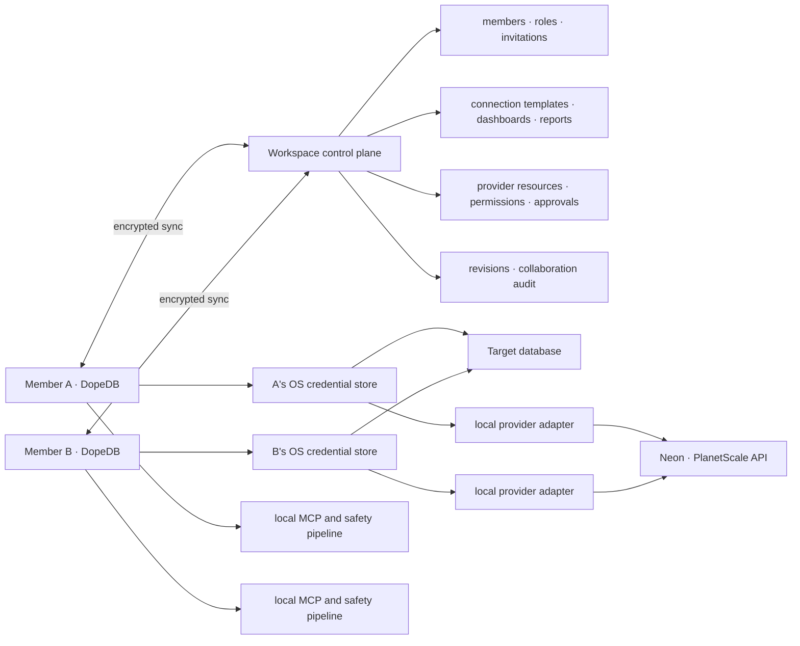

# Workspace Collaboration Roadmap

Status: Milestone 0 implemented; Milestone 1 identity/RBAC implemented; Milestone 2 shared-connection core implemented

This roadmap defines how DopeDB can add team workspaces without turning the
workspace service into a database proxy or weakening the local safety boundary.
Milestones are ordered by dependency and exit criteria rather than calendar date.

## Product Decision

Use a local-execution, hosted-control-plane architecture:

- Keep `site/` as the public marketing deployment at `dopedb.dev`.
- Build `workspace-cloud/` as a separate Next.js application and Vercel Project at
  `app.dopedb.dev`. It owns the authenticated web surfaces and `/api/v1/*` control-plane
  routes. API and account UI deploy together initially; they can split later without
  changing the versioned API contract.
- Use the `workspace_control` schema in hosted PostgreSQL for collaboration metadata.
  Only `workspace-cloud` receives its database URL; the desktop app never connects to
  the control-plane database directly.

- The workspace service synchronizes membership, connection templates, dashboards,
  analysis reports, revisions, and collaboration audit events.
- Each desktop app keeps database credentials in that member's OS credential store.
- Provider API credentials also remain bound to a member and device by default. The
  workspace service synchronizes redacted provider resource metadata, not raw API
  tokens or one-time credentials.
- Queries continue to run from the desktop app through the existing Rust safety,
  monitoring, audit, and read-only execution paths.
- Query result rows are not synchronized by default. Publishing a bounded result
  snapshot is a separate, explicit action with masking and retention controls.
- Workspace membership never grants target-database write access or `pg_monitor`.
  Those remain database-side privileges of the credential used on each device.
- Database drivers and provider control-plane adapters remain separate. A driver
  connects to PostgreSQL, MySQL, MongoDB, or a graph database; a provider adapter
  discovers and manages Neon, PlanetScale, or another hosted service.



## Deployment and Identity Decision

The first hosted control plane uses one dedicated Next.js/Vercel project rather than
adding API routes to the marketing site. This separates database credentials, auth
secrets, deployments, rollback, logs, rate limits, and preview environments from public
site changes while keeping the code in this repository.

Better Auth is the authentication and membership boundary, using its Drizzle adapter,
Google provider, Organization plugin, Bearer plugin, and RFC 8628 Device Authorization
plugin. Drizzle schema and migrations are the source of truth for hosted PostgreSQL.

Desktop sign-in follows Better Auth's standard device authorization flow:

1. The desktop requests codes from `POST /api/auth/device/code` with the fixed,
   server-validated `dopedb-desktop` client id.
2. Better Auth returns a high-entropy device code, a human-readable user code, and an
   `app.dopedb.dev/auth/device` verification URL that expires after ten minutes.
3. The browser completes Google sign-in through Better Auth's callback and state checks.
4. The signed-in user claims and explicitly approves or denies the displayed user code.
5. The desktop polls `POST /api/auth/device/token` at the server-provided interval. An
   approved code is consumed once and returns a Better Auth Bearer session.
6. The desktop stores the Bearer session in the OS credential store and sends it only
   over HTTPS. Better Auth owns rotation, expiry, revocation, and rate limiting.

Google is requested only for identity scopes. Database hooks clear provider access,
refresh, and ID token values before every account create or update, so the account row
retains the provider subject but not reusable Google credentials.

The authenticated web surface initially covers device-login completion, invitation
acceptance, account/session management, and workspace membership administration. Normal
database work remains in the Tauri app.

## Goals

- Let a user create a workspace and invite teammates with clear roles.
- Share connection definitions without sharing raw passwords by default.
- Let each member bind their own database credential to a shared connection.
- Let each member bind a provider API credential to a workspace integration and
  import only resources that both the provider and workspace authorize.
- Apply workspace roles, resource grants, provider-token scopes, environment policy,
  and local safety checks as narrowing layers rather than interchangeable authority.
- Share and version dashboard definitions across members and devices.
- Save agent analysis as a durable report containing the question, conclusion,
  supporting queries, and the warnings observed before execution.
- Keep offline access to already-synchronized workspace resources.
- Record both database execution activity and collaboration changes without mixing
  their trust guarantees.

## Non-goals for the First Release

- Proxying database traffic through the workspace service.
- Automatically distributing database passwords, certificates, or cloud tokens.
- Claiming that workspace policy can restrict how a member uses a personal provider
  token outside DopeDB. The external provider remains authoritative for that token.
- Granting target-database privileges or PostgreSQL roles through workspace membership.
  An Editor role may permit DopeDB's write path, but the member's own target-database
  credential and the local safety/approval gates must independently permit it.
- Treating provider project, branch, compute, backup, credential, or deployment APIs
  as database-driver responsibilities.
- Persisting every query result or agent conversation to the workspace.
- Public, unauthenticated dashboard links.
- Real-time co-editing of SQL or reports.
- Replacing target-database audit logs with workspace events.

## Shared and Local-only Data

| Resource | Workspace data | Local-only data |
| --- | --- | --- |
| Connection | engine, host, port, database, SSL, environment, safety policy | username, password, token, certificate, connection URL, advanced parameters, local `secret_ref`, live pool |
| Provider integration | provider kind, external organization or project ids, imported resource topology, capability snapshot, workspace policy | API token, OAuth refresh token, local `secret_ref`, one-time credentials |
| Provider operation | redacted request, approval state, provider operation id, outcome | unredacted secret responses and local transport diagnostics |
| Dashboard | title, description, SQL, visualization definition, revision | current result rows |
| Analysis report | question, narrative, query provenance, warnings, selected visualization | unpublished intermediate results |
| Monitoring | desired coverage and policy hints | current load snapshot and credential-specific `pg_monitor` status |
| Project integration | optional repository-relative configuration | absolute `project_dir` on each device |
| MCP | workspace-scoped connection identifiers and policy | MCP token, client session, single-use query plans |
| History and audit | explicit collaboration events and published report provenance | full local query history and hash-chained execution audit |

Connection usernames are member-local and are never supplied by a shared default. A
shared endpoint therefore requires each executable member to bind an individual
database account, preserving target-database attribution.

## Authorization Model

Workspace roles and connection permissions are separate. A broad workspace role
must not imply production database access.

| Capability | Viewer | Analyst | Editor | Admin | Owner |
| --- | ---: | ---: | ---: | ---: | ---: |
| View published dashboards and reports | yes | yes | yes | yes | yes |
| Run an allowed shared read query | no | yes | yes | yes | yes |
| Create analysis drafts | no | yes | yes | yes | yes |
| Edit and publish shared resources | no | no | yes | yes | yes |
| Manage connection templates and policies | no | no | no | yes | yes |
| Invite, remove, and change member roles | no | no | no | yes | yes |
| Transfer ownership or delete the workspace | no | no | no | no | yes |

The initial implementation maps Analyst to read-only execution, Editor to read/write
execution, and Admin/Owner to management. This is only DopeDB application authority:
the target credential, database roles, local safety configuration, and explicit write
approval remain narrowing layers. Per-connection grants such as `access_prod` remain a
later refinement and default to deny until implemented. Existing local credentials and
advanced connection parameters are never inherited by another member or device.

Provider integrations add a separate resource hierarchy:

```text
workspace
└─ provider integration
   └─ organization, project, or database
      └─ branch, endpoint, compute, or deployment resource
         └─ workspace connection template
```

Provider actions use explicit capabilities such as `provider.view`,
`provider.integration.manage`, `provider.resource.import`,
`provider.branch.create`, `provider.branch.delete`, `provider.compute.manage`,
`provider.credentials.manage`, `provider.backup.restore`,
`provider.deploy_request.create`, `provider.deploy_request.approve`, and
`provider.deploy.execute`. An adapter reports which capabilities a particular
provider resource supports; the UI and API must not infer support from the provider
name alone.

Every provider or database operation is evaluated as the intersection of:

1. active workspace membership and role defaults;
2. explicit resource grants and denies;
3. provider-reported capabilities and the bound token's verified scopes;
4. environment policy, including a separate production-access grant; and
5. local database safety and credential state when the operation reaches a database.

An explicit deny wins. A high-scope provider token cannot broaden workspace access,
and an Owner role cannot create authority that the external provider or target
database has not granted. Production, credential, restore, deployment, and
destructive operations can additionally require an approval request.

## Provider Integration Boundary

Keep two adapter contracts with no shared secret-bearing configuration object:

- A `DriverAdapter` connects to a database and implements query execution, schema
  inspection, cancellation, and engine-specific value handling.
- A `ProviderAdapter` talks to a hosted service control plane and implements resource
  discovery plus capability-gated operations such as branch or compute management.

A provider resource may create or update a workspace connection template through a
`provider_resource_id`, but the template does not own the provider token. Database
credentials remain in the existing member/device credential binding, independently
of the provider API credential.

The initial credential mode is member-local: each member stores a provider token in
the OS credential store and calls the provider from the desktop after a workspace
authorization check. In this mode, workspace permissions are an enforceable DopeDB
application boundary, while provider token scopes are the authoritative boundary for
use outside DopeDB.

A later managed credential mode may keep a team service credential in a backend
Vault or KMS-backed secret store and route provider operations through the workspace
service. That mode is required for centrally enforced scheduled automation or for
preventing clients from ever receiving the provider credential. It must not turn the
workspace service into a database query proxy.

## Target Data Model

### Workspace service

- Better Auth `user`, `account`, `session`, and `verification` models own identity.
- Better Auth `organization`, `member`, and `invitation` models own workspace membership.
- Better Auth `device_code` implements expiring RFC 8628 desktop authorization.
- `workspace_profile`: organization lifecycle, encryption key reference, residency,
  and application revision metadata.
- `workspace_connections`: shareable connection template and default safety policy.
- `connection_permissions`: per-member or per-role connection grants.
- `workspace_provider_integrations`: provider kind, external account or organization
  identity, credential mode, status, and workspace policy.
- `workspace_provider_resources`: imported provider resource tree, stable external
  ids, environment, lifecycle state, redacted metadata, and capability snapshot.
- `provider_resource_permissions`: per-member or per-role grants and explicit denies
  scoped to an integration or individual provider resource.
- `provider_operation_requests`: requested action, redacted arguments, risk class,
  approvals, stable idempotency key, provider operation id, and terminal status.
- `dashboards`: workspace-scoped dashboard definition and current revision.
- `analysis_reports`: title, question, summary, draft/published/archive state.
- `analysis_report_blocks`: ordered Markdown, metric, chart, and table blocks.
- `analysis_report_queries`: connection, SQL, query-run provenance, warnings, row count,
  duration, schema fingerprint, and optional result snapshot reference.
- `resource_revisions`: immutable revision metadata for conflict detection and rollback.
- `workspace_audit_events`: actor, device, action, resource, before/after revision,
  timestamp, and a redacted change summary.
- `result_snapshots`: optional encrypted, bounded, masked objects with expiry.

### Desktop store

- Add `workspace_id`, `remote_id`, `revision`, `sync_status`, and `deleted_at` to
  synchronizable resources.
- Add `credential_bindings` keyed by workspace connection, member, and device. Its
  `local_secret_ref` never leaves the device.
- Add `provider_credential_bindings` keyed by provider integration, member, and
  device, including the external identity, verified scope summary, verification time,
  and local `secret_ref`. The credential itself never enters sync storage.
- Add `sync_outbox` for durable offline mutations and `sync_state` for pull cursors.
- Keep query history, schema cache, live monitoring snapshots, and the existing
  hash-chained execution audit local by default.

Existing local UUIDs should remain stable. On migration, create a local Personal
Workspace and assign every existing connection, dashboard, and snippet to it. Signing
in must not be required to keep using that personal workspace.

## Analysis Report Contract

An analysis report is distinct from a dashboard:

- A dashboard stores a reusable query and renders current data after a local rerun.
- A report stores a question, a versioned conclusion, and the exact queries used as
  evidence.
- Each evidence query records its MCP preflight decision, monitoring coverage,
  warnings, execution timestamp, row count, duration, and query-run identifier.
- Result rows remain local unless an editor explicitly publishes a snapshot.
- Publishing a snapshot requires a row and byte cap, column selection or masking,
  a sensitivity confirmation, a retention deadline, and an audit event.
- A report rerun creates new evidence rather than silently replacing old evidence.

This gives readers both a durable historical conclusion and a safe way to refresh it
against current data.

## Synchronization Contract

- The service is authoritative for workspace membership, permissions, and the latest
  shared resource revision.
- The desktop remains authoritative for credentials and actual database execution.
- Local mutations enter an outbox before network transmission.
- Pushes use optimistic concurrency with the resource revision as a precondition.
- Pulls use an ordered cursor and include tombstones for deletions.
- SQL, connection policy, and report conflicts are never silently merged. Preserve
  both versions and require an explicit choice or a new merged revision.
- Retry operations are idempotent through stable operation identifiers.
- Provider mutations are never accepted from an offline outbox without a fresh
  authorization and approval check. Their idempotency keys prevent a reconnect or
  timeout from repeating a destructive external action.
- A revoked member loses future sync and workspace key access. The product must state
  honestly that revocation cannot erase data the member already exported.

The first hosted version should use TLS plus per-workspace envelope encryption at
rest, with data keys wrapped by a managed KMS. Raw credentials remain excluded from
the service entirely. End-to-end encrypted workspace content can be evaluated later
as a separate product and recovery design because it changes search, invitations,
device recovery, and server-side collaboration behavior.

## Audit Boundaries

Keep explicit ledgers with distinct trust boundaries:

1. The local execution audit answers which credential executed which database
   statement and whether it was blocked, approved, or completed.
2. The workspace collaboration audit answers who invited a member, shared a
   connection, changed a policy, edited a dashboard, or published a report.
3. Provider operation events answer who requested and approved an external action,
   which resource and idempotency key were used, and which redacted provider outcome
   was observed. In member-local credential mode, this is an application receipt and
   must not be presented as stronger evidence than the provider's own audit log.

Workspace application logs must not contain passwords, result rows, full certificates,
MCP tokens, or unredacted snapshot contents. Collaboration events should reference a
resource revision rather than duplicating sensitive payloads.

## Milestone 0 — Local Workspace Foundation

Deliverables:

- Introduce Workspace, WorkspaceMember, and resource scope types in the Rust/TypeScript
  data contract.
- Introduce a provider-neutral authorization decision contract with actor, action,
  resource hierarchy, environment, reason, and optional approval requirement.
- Migrate existing data into a Personal Workspace without changing existing UUIDs.
- Scope connection, dashboard, and snippet reads/writes by active workspace.
- Add a workspace switcher that initially contains only the Personal Workspace.
- Add local revision, tombstone, outbox, and sync cursor storage.
- Put all new behavior behind a feature flag until migrations and rollback are proven.

Exit criteria:

- Upgrading and downgrading through a backup preserves every existing connection and
  dashboard.
- The app remains fully usable offline and without an account.
- MCP tools cannot resolve a connection outside the currently selected workspace.
- No secret value enters the new workspace or sync tables.

## Milestone 1 — Identity, Membership, and Control Plane

Implementation snapshot (2026-07-22): `workspace-cloud/` now contains the dedicated
Next.js auth/account frontend and `/api/v1` service. Better Auth owns Google sign-in,
Organization membership, Bearer sessions, invitation primitives, database rate limits,
and RFC 8628 desktop authorization. Drizzle ORM is the only application database layer,
Drizzle Kit owns migrations, and the Neon schema has been cut over from the empty SQL
prototype. Workspace creation/listing and active-session visibility are implemented.
Google application credentials and the production Vercel project/domain are configured.
Desktop device authorization now requests and polls Better Auth codes, validates the
resulting Bearer session in Rust, and stores it in the OS credential store without exposing
it to the webview. Authenticated organization memberships are reconciled into the local
workspace switcher at sign-in and app startup. The web console creates verified-email-bound
invitations, exposes a copyable acceptance link, lists members, and lets Admin/Owner assign
read-only Analyst, read/write Editor, or Admin roles. Transactional email delivery remains
optional infrastructure; the acceptance link is functional without it.

Deliverables:

- Add account authentication, device sessions, workspace creation, invitations, and
  role management.
- Deploy `workspace-cloud/` independently from `site/`, with production-only control-plane
  credentials and a separate database/branch for preview deployments.
- Configure Better Auth Google, Organization, Bearer, and RFC 8628 Device Authorization
  plugins over the Drizzle adapter; do not maintain parallel custom auth tables or routes.
- Add minimal web pages for sign-in completion, invitations, sessions, and member admin;
  keep product data exploration in the desktop app.
- Implement authenticated push/pull sync with optimistic revisions and tombstones.
- Add per-workspace encryption, backups, rate limits, and collaboration audit events.
- Add member removal, token revocation, invitation expiry, and workspace deletion
  workflows.
- Provide a self-hosting-compatible API boundary even if the first service is hosted.

Exit criteria:

- Unauthorized users cannot enumerate workspace ids or resource metadata.
- Role and resource permission checks run server-side on every mutation and read.
- Revoked sessions stop syncing immediately.
- Offline edits converge after reconnect, and conflicts retain both versions.
- Server logs and traces pass automated secret and sensitive-payload checks.

## Milestone 2 — Shared Connections

Implementation snapshot (2026-07-22): an Editor or higher can copy a Personal
Workspace connection into a team workspace. The cloud API accepts a strict redacted
template whose schema has no username, password, token, certificate, connection URL,
advanced parameter, or `secret_ref` field. The sharer's secret is duplicated only
inside that device's OS credential store. Other members receive a synchronized template
with Credentials Required state and bind their own username/password locally. Cached
role authority is enforced in manual queries, scripts, previews, schema introspection,
dashboards, monitoring grants, and MCP reads. Analyst is read-only; Editor can enter the
existing local write/approval path; Admin/Owner can manage membership. Target-database
credentials remain authoritative and SQLite file connections are not shareable.

The cached role is only a UI hint. Before a shared connection reads, writes, previews a
write, changes a database monitoring grant, or serves an MCP read, the desktop asks the
control plane to revalidate the active session, current membership, role, workspace id,
and connection id. The check fails closed when the service is unavailable. Removing a
member from DopeDB cannot revoke a database credential they already possess; the target
database administrator must revoke that account separately.

Deliverables:

- Add an explicit Share with Workspace flow for a local connection.
- Synchronize connection templates and default read-safety policies.
- Allow a connection template to reference an optional provider resource without
  embedding provider authentication in the connection profile.
- Add member/device credential binding with local OS credential-store persistence.
- Show Ready, Credentials Required, Access Denied, and Connection Failed states.
- Allow admins to assign per-connection production and read-execution permissions.
- Expose monitoring coverage as a local capability while sharing only the workspace's
  desired policy, such as `pg_monitor` recommended.

Exit criteria:

- A recipient can connect using an individual database account without receiving the
  sharer's secret.
- Sharing, editing, or deleting a connection never changes another member's local
  credential binding.
- Analyst execution is read-only. Editor writes still require the target credential,
  connection safety setting, and explicit local approval. MCP remains read-only and
  still requires `plan_query` before `run_query`.
- Workspace roles cannot grant target-database permissions.
- Removing a connection invalidates future execution but preserves relevant audit
  history.

## Milestone 3 — Read-only Provider Integrations

Deliverables:

- Define a provider-neutral adapter and capability contract independently of database
  drivers.
- Add Neon and PlanetScale adapters for authenticated resource discovery, capability
  detection, and import without provider mutations.
- Add member/device provider credential bindings backed by the OS credential store.
- Synchronize only redacted organization, project, database, branch, endpoint,
  compute, lifecycle, and capability metadata.
- Let an authorized member turn an imported provider database or branch into a
  workspace connection template while keeping the DB credential binding separate.
- Show Credentials Required, Scope Insufficient, Access Denied, Unsupported
  Capability, Provider Unavailable, and Ready states.

Exit criteria:

- Provider API credentials and one-time database credentials never enter workspace
  sync payloads, application logs, or crash reports.
- A member cannot enumerate or import a provider resource into the wrong workspace,
  even by submitting a known external id directly.
- A token with broader provider scopes cannot bypass a workspace deny or production
  access policy inside DopeDB.
- Capability differences are driven by adapter output, so provider products do not
  expose actions they do not support.
- Importing the same external resource is idempotent and preserves the existing
  workspace connection and local credential bindings.

## Milestone 4 — Shared Dashboards

Deliverables:

- Share existing dashboard definitions into a workspace.
- Add draft, published, archived, owner, updated-by, and revision metadata.
- Run shared dashboards locally through the existing read-only dashboard command.
- Add revision history, restore, duplicate-on-conflict, and ownership transfer.
- Show whether a member lacks credentials or execution permission for the dashboard's
  source connection.

Exit criteria:

- Two members can open the same dashboard definition and obtain results through their
  own credentials.
- Result rows are not uploaded during ordinary dashboard viewing.
- Concurrent SQL or visualization changes cannot overwrite each other silently.
- A dashboard cannot reference a connection outside its workspace.

Milestones 0–2 form the workspace and shared-connection foundation. Milestones 0–4
form the first team-product MVP with read-only provider discovery and shared
dashboards.

## Milestone 5 — Saved Agent Analysis Reports

Deliverables:

- Add report list, editor, evidence-query panel, review, and publish flows.
- Let MCP propose a report only from durable successful query-run identifiers.
- Store the original question, narrative conclusion, evidence query metadata, and
  preflight warnings as versioned report content.
- Add explicit rerun and append-new-evidence behavior.
- Add comments and reviewer status only after revision ownership is reliable.

Exit criteria:

- A published report remains understandable without rerunning its queries.
- Every claimed data point can point to an evidence query and execution timestamp.
- An agent cannot publish or replace a report without explicit user agreement.
- Editing a report does not mutate its historical evidence records.

## Milestone 6 — Controlled Provider Operations

Deliverables:

- Add capability-gated operation requests for provider branch, compute, credential,
  backup, restore, and deployment actions supported by each adapter.
- Require fresh server authorization before execution and stable idempotency keys for
  every provider mutation.
- Classify operations by read-only, non-production mutation, production mutation,
  credential-sensitive, restore, and destructive risk.
- Require explicit production access and configurable additional approval for
  production, credential, restore, deployment, and destructive actions.
- Record requester, approver, resource, redacted arguments, provider operation id,
  outcome, and timestamps in the workspace audit stream.
- Keep member-local execution as the default while separately evaluating managed
  Vault-backed credentials for scheduled or centrally enforced automation.

Exit criteria:

- Reconnects, retries, and provider timeouts cannot execute an operation more than
  once.
- Revocation or a permission change between request and execution causes a fresh
  denial rather than using a stale approval.
- Secret-bearing provider responses are displayed once when necessary and are never
  persisted in shared metadata or general audit events.
- Production and destructive actions cannot be self-approved when the workspace
  policy requires a second actor.
- Provider-native audit identifiers are retained so administrators can reconcile
  DopeDB events with the provider's own audit history.

## Milestone 7 — Optional Result Snapshots and Enterprise Controls

Deliverables:

- Add explicit masked result snapshot publishing with row, byte, and retention limits.
- Store snapshot objects separately from workspace metadata with independent keys and
  deletion jobs.
- Add SSO/domain policy, SCIM, configurable retention, and export controls as demand
  requires.
- Evaluate a shared-secret vault integration for teams that cannot issue individual
  database accounts or require centrally enforced provider automation.
- Evaluate end-to-end encryption and self-hosted control-plane packaging separately.

Exit criteria:

- Snapshot access is authorized and audited independently from dashboard access.
- Expired or deleted snapshots are removed from primary storage and scheduled backups
  according to a documented retention policy.
- Shared vault credentials are never returned to the UI or agent and can be revoked
  centrally.
- Enterprise controls do not weaken the default local-credential model.

## Cross-cutting Validation

Every milestone must include:

- Rust and TypeScript migration and serialization tests.
- RBAC tests for every API and local command boundary.
- Provider adapter contract tests for resource hierarchy, capability discovery,
  pagination, rate limits, redaction, and unsupported operations.
- Authorization tests for cross-workspace external ids, explicit denies, production
  gates, provider scope mismatches, stale approvals, and confused-deputy attempts.
- Offline, retry, duplicate-delivery, tombstone, and conflict tests.
- Credential and sensitive-data leak tests covering logs, crash reports, analytics,
  and sync payloads.
- macOS and Windows credential-store behavior.
- Query execution tests proving workspace state cannot bypass read-only enforcement,
  monitoring preflight, row caps, approval gates, or audit recording.
- Recovery tests for workspace deletion, member revocation, and failed partial sync.

## Remaining Product Decisions

- Account recovery and the timing of non-Google identity providers.
- Member-local provider credentials versus managed Vault-backed credentials for each
  operation class, including whether either provider offers an appropriate OAuth flow.
- Provider resource refresh intervals, rate-limit budgets, webhook availability, and
  behavior when an imported resource is deleted outside DopeDB.
- The initial production and destructive-operation approval matrix.
- Workspace billing and ownership transfer rules.
- Whether connection usernames are shared defaults or always local overrides.
- Initial report snapshot limits and retention duration.
- Data residency requirements beyond the initial US-East deployment.
- Whether Personal Workspace resources can remain permanently local or optionally sync
  across the owner's devices.

These decisions do not block Milestone 0 because the local schema should support both
hosted and self-hosted sync implementations.
